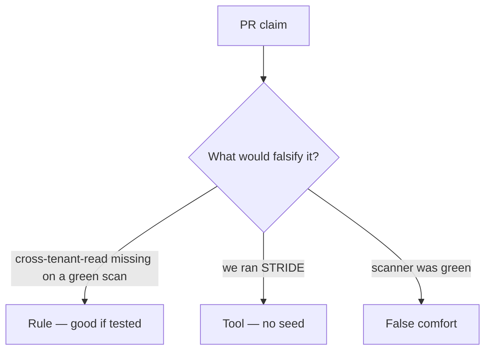

# Review of empty-model-on-green-scan

**Kind:** code-review
**Loop step:** Review

Intended findings live only in the answer-key folder — not here. Do not open that file until your review has been evaluated.

## What you are reviewing

A colleague ships the notes-app threat list. Review `labs/3.2/3.2-lab/vulnerable/` as that change. Your job is not to count suspicious lines. Reconstruct whether `threats_from_scan(True)` still omits `cross-tenant-read`, compare that with the rule, and write changes a developer can verify.

The check you already ran (`test_green_scanner_is_not_an_empty_threat_model`) is the rule test. A comment “will threat-model later” is not.

## Picture: threats = [] if scanner_green

Start with this seeded smell: **threats = [] if `scanner_green`**. Label it rule, tool, or false comfort before you accept the change.

Hold onto always-name id present on green. If that call is missing a seeded join, you still have a leftover path.

## Problems to find (name them yourself)

- threats = [] if `scanner_green`
- No `cross-tenant-read` item
- Model not in version control (only a slide)
- STRIDE letters without assets, owners, or “what would prove this row wrong”

Also reject: treating the client as what you trust; an awareness list cited as a passing score; closing findings without re-running `test_green_scanner_is_not_an_empty_threat_model`; keys in learner notes; real personal data in the practice; a Top 10 as the threat list.

## Common mix-ups

- Green scan means no threats
- Threat models are pre-code only
- Awareness lists are the threat list
- Threat Dragon is the rule
- The data-centric modeling note (**draft**) is a verification catalogue

## Practice

Write three review notes a maintainer could act on. Each note: what you saw, rule or false comfort, suggested structural change, leftover you will **not** delete. Tie at least one to `test_green_scanner_is_not_an_empty_threat_model`. Do not open the keys file.

## Use it somewhere new

Clinic SMS change that “adds a HIPAA sticker” without seeding `sms-content-leak` is an incomplete review. Name the independent falsehood that would still keep `cross-tenant-read` present on green.

## What this page is not doing

Do not merge by adding a comment “will threat-model later.” That comment is leftover risk without an owner. Do not run a live scanner to prove the finding.
