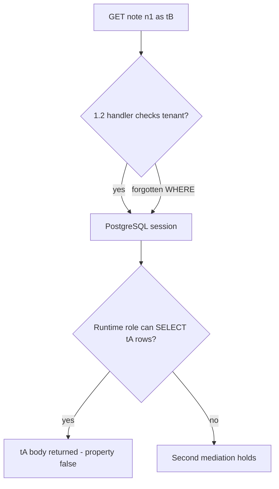
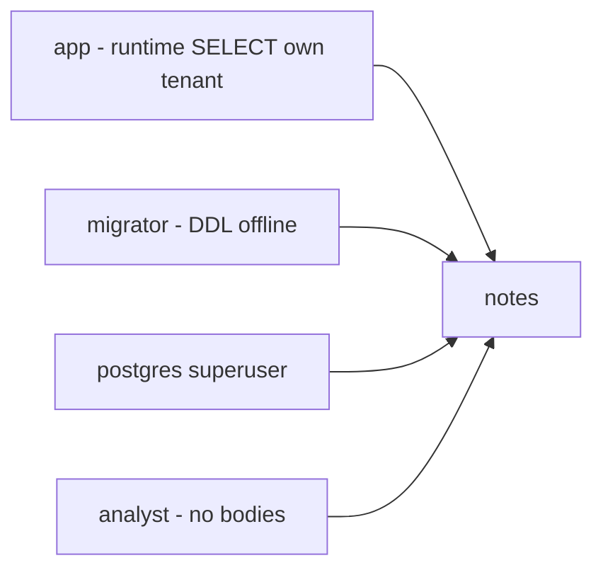

# 3.3-LO-01 — Architecture is a second mediation, not a substitute for 1.2

**Kind:** concept-model
**Loop step:** 1 Property
**Standards:** Saltzer and Schroeder (1975, seminal) least privilege and complete mediation; OWASP ASVS 5.0.0 (final) `v5.0.0-8.4.1` (Level 2 cross-tenant controls), `v5.0.0-8.2.2`, `v5.0.0-8.3.1`; `v5.0.0-15.2.5` is **Level 3, advanced** (isolation around dangerous functionality). CISA Secure by Design is living guidance and **unverified** in this repo’s pin (403 on fetch). NIST SSDF 1.1 (final); SSDF 1.2 remains **draft**.

## The claim this module owns

SecureCollab Phase 1 FastAPI handlers must still mediate tenant reads (1.2). That is not enough if the PostgreSQL role in `DATABASE_URL` can `SELECT` every notes row. A forgotten `WHERE tenant_id = …`, later SQLi (6.1), or a stolen app password then becomes a cross-tenant dump. Architecture is a **second** mediation: the runtime role must not be able to read another tenant even when the handler is wrong.

> For a SecureCollab Phase 1 notes table, the runtime `app` role bound as tenant `tB` must not `SELECT` a row whose `note_tenant` is `tA`. SQLAlchemy, a VPC, or “we use microservices” does not enforce this. RLS (5.5) is a later layer, not a comment that ships.

The forbidden outcome is **shared app role reads tA as tB**: `can_select("app", "tB", "tA") is True`. That is a 1.1 confidentiality failure with a 1.2 cell that the database did not catch.

ASVS `v5.0.0-8.4.1` wants cross-tenant controls so operations never affect another tenant. `v5.0.0-8.2.2` wants data-specific access. `v5.0.0-8.3.1` wants enforcement at a trusted service layer, not the Next.js client. `v5.0.0-15.2.5` is **Level 3 (advanced)** extra isolation around dangerous functionality — not a silent baseline. CISA’s manufacturer-ownership language does not configure `GRANT`.

## Mental model: two gates, one forgotten WHERE



The TCB for this module is the **runtime connection role plus its grants** (lab stand-in: `can_select`). The handler is still required. Trusting ORM defaults or a pooler user named `app` without a tenant predicate is not a TCB.

**Mechanism (not the property):** SQLAlchemy `session`, Kubernetes NetworkPolicy, or an RLS ticket titled “later.”

## Mental model: data plane vs administrative plane



Migrator and superuser exist. They must not be `DATABASE_URL` at request time. Stolen migrator is a residual with a shorter life and a different owner — not a reason to run the API as that user.

## Root cause vs impact vs prevention vs detection vs recovery

| Slice | For this property |
|---|---|
| Root cause | One omnipotent DB user shared by app and migrate |
| Preconditions | Runtime role can `SELECT` other tenants |
| Trigger | Forgotten WHERE, SQLi, or stolen app password |
| Impact | Confidentiality of tA notes |
| Prevention | Least-privilege runtime role; tenant predicate in the role/RLS |
| Detection | `grant_drift` in CI; connection-user metric |
| Recovery | Rotate the password; review `GRANT`; do not log bodies |

## Framework defaults versus the architecture guarantee

FastAPI does not scope PostgreSQL. A microservice split without new grants is a topology drawing. The lab guarantee: `can_select("app", "tB", "tA") is False` and the runtime connection is not `postgres`. Oracle: `labs/3.3/3.3-lab`. No live databases.

## Mechanism limits

- RLS bypassed by table owners and `SECURITY DEFINER` (E5).
- Connection pooler user; analytics replica without RLS (clinic transfer).
- Comment “RLS later” on the production path.

## Practice

Draw app vs migrator vs analyst. Then run:

```
python3 -m pytest labs/3.3/3.3-lab/tests --impl vulnerable
python3 -m pytest labs/3.3/3.3-lab/tests --impl fixed
```

The first command must fail. The second must pass. Map the assertion to `tB` reading `tA`, not to a VPC diagram.

## Transfer

Serverless function with a shared `admin` connection string. Clinic billing replica: another plane, same rule.

## Non-goals

Live RDS, real tenant dumps, weaponized SQL payloads, and “microservices isolate tenants.” Gates 0–10 and milestones M0–M5 stay **not-attempted** without learner or product evidence. Answer keys are not in this file.
