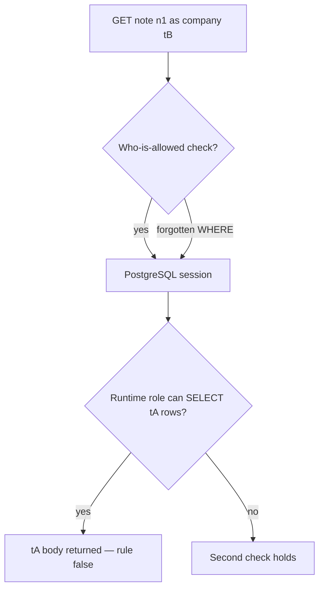
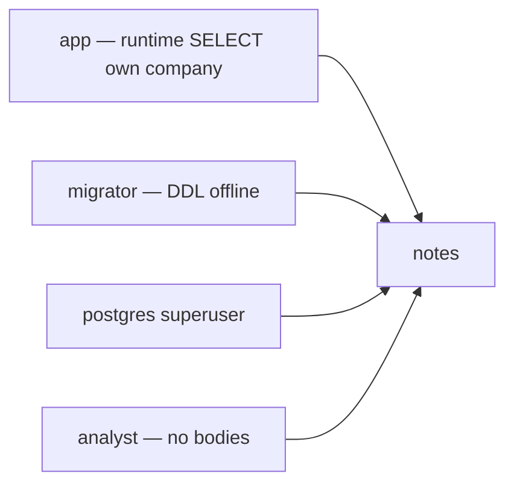

# Architecture is a second check, not a substitute for who-is-allowed

**Kind:** concept-model
**Loop step:** 1 Property

## The rule

The notes app’s FastAPI handlers must still check who is allowed to read a note. That is not enough if the PostgreSQL role in `DATABASE_URL` can `SELECT` every notes row. A forgotten `WHERE` on the company, a later injection into SQL, or a stolen app password then becomes a dump of another company’s notes.

Architecture is a **second** check: the role the app uses at request time must not be able to read another company’s row even when the handler is wrong.

> For a notes table, the runtime `app` role bound as company `tB` must not `SELECT` a row whose `note_tenant` is `tA`. SQLAlchemy, a private network, or “we use microservices” does not enforce this. A later row-level rule in the database is a later layer, not a comment that ships.

What must not happen is a **shared app role that reads tA as tB**: `can_select("app", "tB", "tA") is True`. Who-is-allowed failed, and the database did not catch it. That is a secrecy failure.

There has to be a second check so work never hits another company’s rows, and that check belongs on a trusted server, not in the Next.js client. Extra isolation around dangerous work is an advanced row, not this week's check. A manufacturer-ownership pledge does not configure `GRANT`.

## Picture: two gates, one forgotten WHERE



What you trust for this topic is the **runtime connection role plus its grants** (lab stand-in: `can_select`). The handler is still required. Trusting ORM defaults or a pooler user named `app` without a same-company check is not what you trust.

**A tool is not the rule.** SQLAlchemy `session`, a Kubernetes network policy, or a ticket titled “row-level security later.”

## Picture: the running app versus migrate and look-but-don’t-read



Migrator and superuser exist. They must not be `DATABASE_URL` at request time. A stolen migrator password is leftover risk with a shorter life and a different owner — not a reason to run the API as that user.

## Why it happens, what it costs, how you stop it, how you notice, how you recover

| Slice | For this rule |
|---|---|
| Why it happens | One all-powerful database user shared by the app and migrate |
| What has to be true first | The runtime role can `SELECT` other companies |
| Trigger | Forgotten WHERE, later SQL injection, or a stolen app password |
| What it costs | Secrecy of company tA’s notes |
| How you stop it | Least-privilege runtime role; same-company check in the role or a later row-level rule |
| How you notice | `grant_drift` in CI; who connected |
| How you recover | Rotate the password; review `GRANT`; do not log bodies |

## What the framework does vs what you still have to check

FastAPI does not scope PostgreSQL. Splitting into microservices without new grants is a topology drawing. What this practice is supposed to show: `can_select("app", "tB", "tA") is False` and the runtime connection is not `postgres`. The folder is `labs/3.3/3.3-lab`. No live databases.

## What the tool cannot do

- A table owner or a function that runs as the owner can walk around a later row-level rule (later topic).
- A connection-pooler user; an analytics copy without the same-company check (clinic transfer).
- A comment “row-level security later” on the production path.

## Practice

Draw app vs migrator vs analyst. Then run:

```text
python3 -m pytest labs/3.3/3.3-lab/tests --impl vulnerable
python3 -m pytest labs/3.3/3.3-lab/tests --impl fixed
```

Tie the check to `tB` reading `tA`, not to a private-network diagram.

## Use it somewhere new

A serverless function with a shared `admin` connection string. A clinic billing copy: another lane, same rule.

## What this page is not doing

Live cloud databases, real company dumps, weaponized SQL, and “microservices isolate companies.” This page does not finish a check-in. Answer keys are not on this site.
