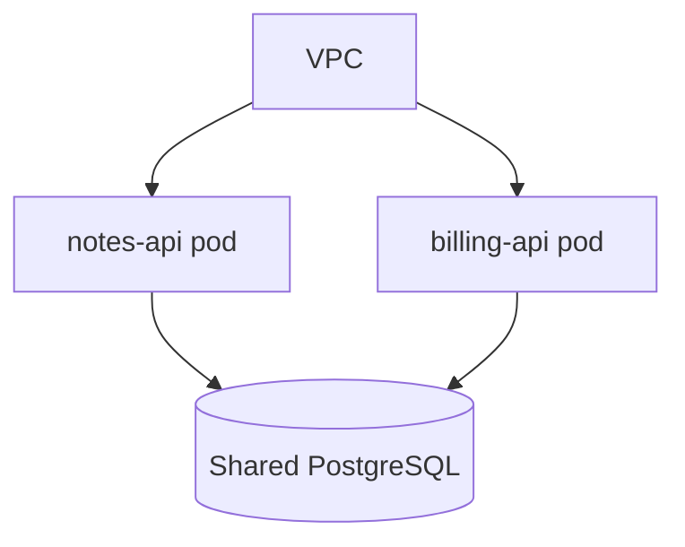
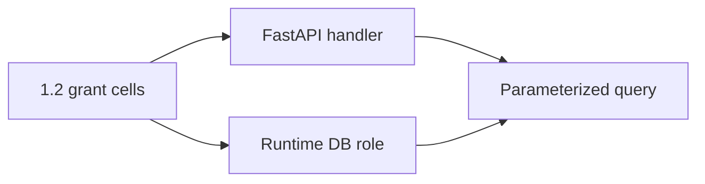

# 3.3-LO-02 — Compartments a second engineer can test

**Kind:** design-exercise
**Loop step:** 2 Model
**Standards:** Saltzer and Schroeder (1975, seminal) least privilege; OWASP ASVS 5.0.0 (final) `v5.0.0-8.4.1` and `v5.0.0-8.3.1`.

## Can a second engineer name pytest cases from your ADR?

“We use Postgres RLS” is not this lesson. A reviewable architecture names **roles**, **planes**, **what each may SELECT**, and **the rejected alternative** (one superuser in `DATABASE_URL`).

SecureCollab Phase 1 freeze: notes rows keyed by tenant; local `can_select` stand-in. No live cluster, no production replica.

## Mental model: topology is not isolation

Two services in one VPC still share a breach if they share an omnipotent role. Microservices, serverless, and monoliths are trade-offs; none is inherently tenant-safe.

## Mental model: centralized policy, local enforcement

Policy lives in one place (who may read). Enforcement happens in the handler **and** in the role. Client-side hiding of notes is not `v5.0.0-8.3.1`.

## Step 1: freeze pieces

| Piece | This system |
|---|---|
| Subjects | `app` role; `migrator`; `postgres`; analyst; FastAPI handler |
| Objects | notes rows by tenant |
| Actions | `can_select`; `runtime_connection_role` |
| Channels | SQL session / connection string |
| TCB | Runtime grants + 1.2 handler |
| Untrusted | ORM default user; forgotten WHERE; Next.js |
| State / time | Migration leftover `SUPERUSER` in `DATABASE_URL` |
| 1.1 cell | Confidentiality defense-in-depth |

## Step 2: write cells

| Subject | Object | Action | Decision |
|---|---|---|---|
| app | own tenant rows | SELECT | allow |
| app | other tenant rows | SELECT | deny |
| migrator | notes bodies | SELECT at runtime | deny |
| migrator | ddl | ALTER offline | allow |
| analyst | bodies | SELECT | deny-or-tokenize |

## Step 3: ADR (rejected alternative)

Rejected: one `postgres` URL for migrate and serve. Chosen: runtime `app` with tenant predicate; migrator credential offline and short-lived. SSDF 1.1 PW.1 is vocabulary for recording that decision; it is not the pytest.

## Practice

Draw this map so a second engineer could name pytest cases. Point at `labs/3.3/3.3-lab` file `roles.py`.

## Transfer

Serverless + shared admin string. Clinic billing replica.

## Residual risk

Stolen migrator; table-owner RLS bypass (E5); replica without the same grants.

## Non-goals

Top 10 as the definition of security. Keys stay out of lessons.
