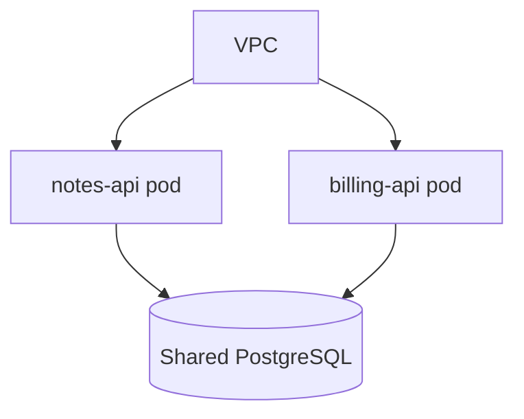
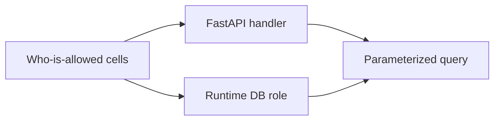

# Compartments someone else can test

**Kind:** design-exercise
**Loop step:** 2 Model

## Could someone else name checks from your decision record?

“We use Postgres row-level security” is not this page. A reviewable architecture names **roles**, **lanes**, **what each may SELECT**, and **the rejected alternative** (one superuser in `DATABASE_URL`).

Notes rows keyed by company; a local `can_select` stand-in. No live cluster, no production replica.

## Picture: topology is not isolation

Two services in one private network still share a breach if they share an all-powerful role. Microservices, serverless, and monoliths are trade-offs; none is inherently company-safe.

## Picture: one policy, two places that enforce it

Policy lives in one place (who may read). Enforcement happens in the handler **and** in the role. Hiding notes in the Next.js client is not a trusted-server check.

## Step 1: name the pieces

| Piece | This system |
|---|---|
| Who | `app` role; `migrator`; `postgres`; analyst; FastAPI handler |
| What | notes rows by company |
| Actions | `can_select`; `runtime_connection_role` |
| Paths | SQL session / connection string |
| What you trust | Runtime grants + the who-is-allowed handler |
| What you do not trust | ORM default user; forgotten WHERE; Next.js |
| State / time | Migration leftover `SUPERUSER` in `DATABASE_URL` |
| The rule | Secrecy with a second check |

## Step 2: write rows the lab can fail

| Who | What | Action | Decision |
|---|---|---|---|
| app | own company rows | SELECT | allow |
| app | other company rows | SELECT | deny |
| migrator | note bodies | SELECT at runtime | deny |
| migrator | ddl | ALTER offline | allow |
| analyst | bodies | SELECT | deny-or-tokenize |

## Step 3: write the rejected choice

Rejected: one `postgres` URL for migrate and serve. Chosen: runtime `app` with a same-company check; migrator credential offline and short-lived. Writing that decision down is useful. It is not the check.

## Practice

In `labs/3.3/3.3-lab`, mark `roles.py`.

## Use it somewhere new

Serverless plus a shared admin string. Clinic billing replica.

## What can still go wrong

Stolen migrator; table-owner walk-around of a later row-level rule; a replica without the same grants.

## What this page is not doing

A SQL-injection ranking does not drop the `postgres` role. Answer keys are not on this site.
