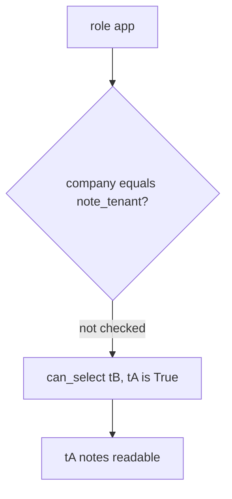

# Practice: the app database role can read another company's rows

**Kind:** mechanism-lab
**Loop step:** 3 Break

## Try it

The practice is not a website you attack. It is a tiny in-process `can_select` check. It does not open PostgreSQL, a cloud database, or a classmate’s replica. The failure is already in the object: every role can read every company. That is a **failed rule**, not a topology drawing.

The rule under test:

> The runtime `app` role bound as company `tB` must not `SELECT` a row whose company is `tA`. Architecture is a second check, not a substitute for who-is-allowed.

## Where you may practice

Only `labs/3.3/3.3-lab` is in scope. Fake company ids `tA` / `tB`. Restore the broken and repaired folders when you are done.

Do not run `SELECT` against a live cluster, an employer replica, or a public demo database. Do not point this exercise at a classmate’s FastAPI or a production notes app.

What must not happen: the app database role can read another company’s rows. `can_select("app", "tB", "tA") is True`.

Who could do this: a forgotten `WHERE`, later injection into SQL, or a stolen app password that can call `can_select` as company `tB`. That stands in for an all-powerful `DATABASE_URL`. What is supposed to stop this: the runtime role is a **second** check after who-is-allowed. SQLAlchemy, a private network, and “we use microservices” are not enough.

## Picture: a role with no same-company check



The broken files show **cause** (all-powerful runtime user / missing same-company check), not a trophy `SELECT *` against a real cluster. What has to be true first: `can_select` returns `True` for every role; `runtime_connection_role` is `postgres`. You do not need a live dump. You must not dump a live cluster.

A private-network diagram is a topology observation, not that second check.

## What to look at: the cause, not a trophy

Read `vulnerable/roles.py`. `can_select` returns `True` for every role and company. `runtime_connection_role` is `postgres`. Checks:

- `test_app_role_cannot_read_other_tenant` — `can_select("app", "tB", "tA") is False`
- `test_migrator_cannot_select_notes_at_runtime`
- `test_runtime_connection_is_not_superuser`
- `test_app_role_can_read_own_tenant` — honest path (may fail on the broken files too)

You do not need a new company id. The failure of `test_app_role_cannot_read_other_tenant` *is* the evidence.

## Why it happens, what it costs, how you stop it, how you notice, how you recover

| Slice | This practice |
|---|---|
| The rule | Runtime `app` bound as `tB` cannot read `tA` rows |
| Why it happens | One all-powerful database user shared by the app and migrate |
| What has to be true first | The runtime role can `SELECT` other companies |
| Trigger | `can_select("app", "tB", "tA")` |
| What it costs | Secrecy of tA notes; a who-is-allowed check the database did not catch |
| How you stop it | Least-privilege runtime role; same-company check in the role or a later row-level rule |
| How you notice | `grant_drift` in CI; who connected |
| How you recover | Rotate the password; review `GRANT`; do not log bodies |
| Not the lesson | A private-network diagram, microservice count, or a manufacturer pledge |

## What the framework does vs what you still have to check

FastAPI does not scope PostgreSQL. Splitting into microservices without new grants is a topology drawing. What this practice is supposed to show: `can_select("app", "tB", "tA") is False`.

## Practice

```text
python3 -m pytest labs/3.3/3.3-lab/tests --impl vulnerable
```

Record `test_app_role_cannot_read_other_tenant`. Do not weaken it to “a role named app exists.” A setup error is not proof the rule holds.

## Use it somewhere new

A serverless admin string. Predict the `can_select` analogue without leaving this directory. Do not connect to a cloud database.

## What this page is not doing

No live-target SQL. Fake company ids only. No weaponized payloads. Do not “fix” the practice by deleting the check.
