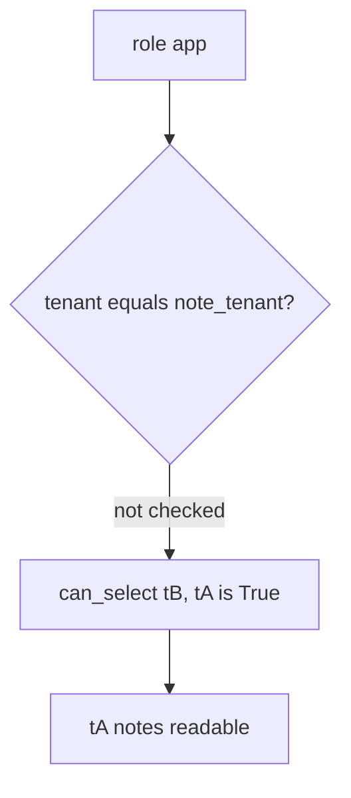

# 3.3-LO-03 — Observe tB reading tA, do not trophy a dump

**Kind:** mechanism-lab
**Loop step:** 3 Break
**Standards:** OWASP ASVS 5.0.0 (final) `v5.0.0-8.4.1`; Saltzer and Schroeder (1975, seminal) least privilege. CISA Secure by Design remains **unverified** in this pin set.

## Authorized scope

`labs/3.3/3.3-lab` only. The fixture is an in-process `can_select` predicate. Synthetic tenant ids `tA` / `tB`. It does not open PostgreSQL, RDS, or a classmate database. Do not run `SELECT` against a live cluster, an employer replica, or a public demo DB.

**Forbidden outcome:** the app DB role can SELECT another tenant's rows. `can_select("app", "tB", "tA") is True`.

Attacker capability in this lab: a forgotten `WHERE`, later SQLi (6.1), or a stolen app password that can call `can_select` as tenant `tB`. That stands in for an omnipotent `DATABASE_URL`. Trust assumption: the runtime role is supposed to be a **second** mediation after 1.2. SQLAlchemy, a VPC, and “we use microservices” are not in the TCB for this cell.

## Mental model: role without a tenant predicate



The vulnerable tree demonstrates **cause** (omnipotent runtime user / missing tenant predicate), not a trophy `SELECT *` against a real cluster. Preconditions: `can_select` returns `True` for every role; `runtime_connection_role` is `postgres`. You do not need a live dump. You must not dump a live cluster.

ASVS `v5.0.0-8.4.1` wants cross-tenant controls so operations never affect another tenant. A VPC diagram is a topology observation, not that control.

## What to read in the fixture

`vulnerable/roles.py` `can_select` returns `True` for every role and tenant. `runtime_connection_role` is `postgres`. Tests:

- `test_app_role_cannot_read_other_tenant` — `can_select("app", "tB", "tA") is False`
- `test_migrator_cannot_select_notes_at_runtime`
- `test_runtime_connection_is_not_superuser`
- `test_app_role_can_read_own_tenant` — honest path (may fail on vulnerable too)

You do not need a new tenant id. The failure of `test_app_role_cannot_read_other_tenant` *is* the evidence.

Do not open the fixed tree yet. Diagnose the cause first.

## Root cause vs impact vs prevention vs detection vs recovery

| Slice | This lab |
|---|---|
| Required property | Runtime `app` bound as `tB` cannot read `tA` rows |
| Root cause | One omnipotent DB user shared by app and migrate |
| Preconditions | Runtime role can `SELECT` other tenants |
| Trigger | `can_select("app", "tB", "tA")` |
| Impact | Confidentiality of tA notes; 1.2 cell the database did not catch |
| Prevention | Least-privilege runtime role; tenant predicate in the role/RLS |
| Detection | `grant_drift` in CI; connection-user metric |
| Recovery | Rotate the password; review `GRANT`; do not log bodies |
| Not the lesson | A VPC diagram, microservice count, or CISA pledge |

## Framework defaults versus the architecture guarantee

FastAPI does not scope PostgreSQL. A microservice split without new grants is a topology drawing. The application guarantee is: **this** fixture, `can_select("app", "tB", "tA") is False`.

## Practice

```text
python3 -m pytest labs/3.3/3.3-lab/tests --impl vulnerable
```

Record `test_app_role_cannot_read_other_tenant`. Do not weaken it to “a role named app exists.” An environment error is not security evidence.

## Transfer

Serverless admin string. Predict the `can_select` analogue without leaving this directory. Do not connect to a cloud database.

## Non-goals

No live-target SQL. Synthetic tenant ids only. No weaponized payloads.
