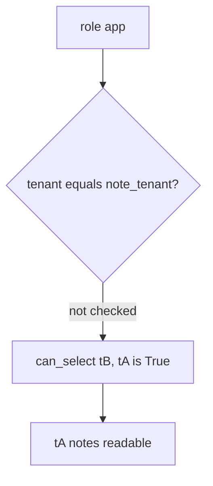

# 3.3-LO-03 — Observe tB reading tA, do not trophy a dump

**Kind:** mechanism-lab
**Loop step:** 3 Break
**Standards:** OWASP ASVS 5.0.0 (final) `v5.0.0-8.4.1`.

## Authorized scope

`labs/3.3/3.3-lab` only. Synthetic tenant ids `tA` / `tB`. No live databases.

**Forbidden outcome:** App DB role can SELECT another tenant's rows.

## Mental model: role without a tenant predicate



The vulnerable tree demonstrates **cause** (omnipotent runtime user / missing tenant predicate), not a trophy `SELECT *` against a real cluster.

## What to read in the fixture

`vulnerable/roles.py` `can_select` returns `True` for every role and tenant. `runtime_connection_role` is `postgres`. Tests assert `can_select("app", "tB", "tA") is False`, migrator cannot SELECT at runtime, the runtime role is not superuser, and own-tenant still works on the fixed tree.

## Root cause vs impact

| Slice | Lab |
|---|---|
| Root cause | One omnipotent DB user shared by app and migrate |
| Impact | Forgotten WHERE becomes a breach |
| Not the lesson | A VPC diagram or microservice count |

## Practice

```
python3 -m pytest labs/3.3/3.3-lab/tests --impl vulnerable
```

Record `test_app_role_cannot_read_other_tenant`. Do not weaken it to “a role named app exists.”

## Transfer

Serverless admin string. Predict `can_select` analogue without leaving this directory.

## Non-goals

No live-target instructions. Synthetic data only.
