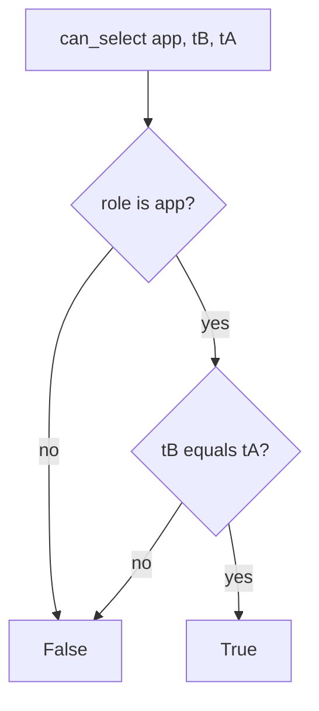

# 3.3-LO-04 — Bind the runtime role to the tenant

**Kind:** design-exercise
**Loop step:** 4 Build
**Standards:** OWASP ASVS 5.0.0 (final) `v5.0.0-8.4.1` and `v5.0.0-8.3.1`.

## Structural means the other tenant is unreadable

`can_select("app", "tB", "tA")` must be false. Structural means the runtime role’s predicate (lab) or RLS policy (later 5.5) actually compares tenant — not a denylist of ids, not “trust the handler,” not a comment.

## Mental model: deny unless same tenant



Fail-safe: unknown role denies. Own tenant still allows. Runtime connection is `app`, not `postgres`.

## Why this restores the cell

| After the fix | Must be true |
|---|---|
| Cross-tenant | `can_select("app", "tB", "tA") is False` |
| Honest path | `can_select("app", "tA", "tA") is True` |
| Admin plane | migrator cannot SELECT notes at runtime |

## What this is not

SQLAlchemy session scope. RLS as a ticket. Microservices. `SECURITY DEFINER` bypass (E5).

## Practice

Name subject, object, and predicate. Run:

```
python3 -m pytest labs/3.3/3.3-lab/tests --impl fixed
```

Must pass.

## Transfer

Serverless: the function role is the runtime role. Clinic replica: the replica role is another plane.

## Residual risk

Stolen `app` password still reads **that** tenant; rotate. Stolen migrator is worse — keep it offline.
