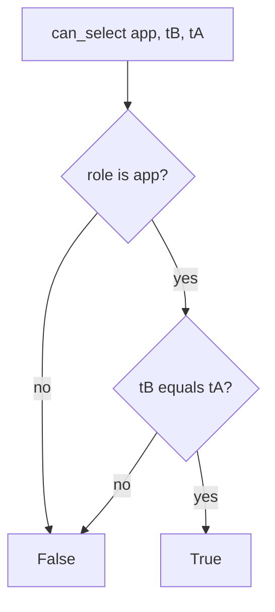

# Bind the runtime role to the company

**Kind:** design-exercise
**Loop step:** 4 Build

## The rule

`can_select("app", "tB", "tA")` must be false. Read it as the runtime role’s check (lab) or a later row-level rule actually compares company — not a denylist of ids, not “trust the handler,” not a comment “row-level security later,” not a private network, not a microservice box on a slide.

The check in notes: only role `app` may SELECT at runtime, and only when the caller’s company equals `note_tenant`. By default: unknown role denies. Own company still allows. Runtime connection is `app`, not `postgres` or `migrator`.

## Picture: deny unless same company



The lab’s repaired files use `RUNTIME_SELECT_ROLES = {"app"}` and a company equality check. Production should bind the session to a company so a forgotten WHERE still fails closed. Migrator and superuser exist; they must not be `DATABASE_URL` at request time.

Enforcement belongs on a trusted server, not in the Next.js client. The check is the **database** half of that sentence. Who-is-allowed in the handler remains required.

## What the repaired files must show

| After the fix | Must be true |
|---|---|
| Cross-company | `can_select("app", "tB", "tA") is False` |
| Honest path | `can_select("app", "tA", "tA") is True` |
| Migrate lane | migrator cannot SELECT notes at runtime |
| Connection | `runtime_connection_role()` is not `postgres` or `migrator` |

## What this is not

SQLAlchemy session scope. Row-level security as a backlog ticket. Microservices. A function that runs as the table owner (later topic). A Kubernetes network policy. A manufacturer-ownership pledge.

## What can still go wrong

- A table owner or a function that runs as the owner can walk around a later row-level rule (later topic).
- A connection-pooler user; an analytics copy without a same-company check (clinic transfer).
- A stolen `app` password still reads **that** company; rotate.
- Stolen migrator is worse — keep it offline; shorter life, different owner.
- Replica fleet without the same grants; a comment “row-level security later” returning on the production path.

## Practice

Name who (runtime role `app` as `tB`), what (`tA` note row), check (SELECT denied). Run:

```text
python3 -m pytest labs/3.3/3.3-lab/tests --impl fixed
```

## Use it somewhere new

Serverless: the function role is the runtime role. Clinic replica: the replica role is another lane and must not `SELECT` chart text.

## What this page is not doing

Do not connect to a live cloud database. Do not treat a role name as a finished check-in.
