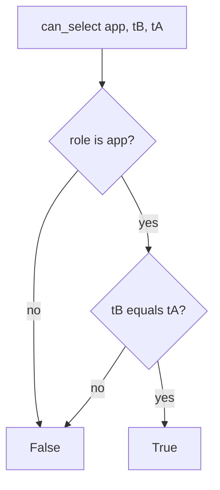

# 3.3-LO-04 — Bind the runtime role to the tenant

**Kind:** design-exercise
**Loop step:** 4 Build
**Standards:** OWASP ASVS 5.0.0 (final) `v5.0.0-8.4.1` and `v5.0.0-8.3.1`. `v5.0.0-15.2.5` is **Level 3, advanced** extra isolation, not this pytest. CISA Secure by Design remains **unverified**.

## Structural means the other tenant is unreadable

`can_select("app", "tB", "tA")` must be false. Structural means the runtime role’s predicate (lab) or RLS policy (later 5.5) actually compares tenant — not a denylist of ids, not “trust the handler,” not a comment “RLS later,” not a VPC, not a microservice box on a slide.

The smallest restore for SecureCollab Phase 1 notes is: only role `app` may SELECT at runtime, and only when `tenant == note_tenant`. Fail-safe: unknown role denies. Own tenant still allows. Runtime connection is `app`, not `postgres` or `migrator`.

## Mental model: deny unless same tenant



The lab’s fixed tree uses `RUNTIME_SELECT_ROLES = {"app"}` and a tenant equality check. Production should bind the session to a tenant (SET / RLS) so a forgotten WHERE still fails closed. Migrator and superuser exist; they must not be `DATABASE_URL` at request time.

ASVS `v5.0.0-8.3.1` wants enforcement at a trusted service layer, not the Next.js client. This pytest is the **database** half of that sentence. Handler mediation (1.2) remains required.

## Why this restores the cell

| After the fix | Must be true |
|---|---|
| Cross-tenant | `can_select("app", "tB", "tA") is False` |
| Honest path | `can_select("app", "tA", "tA") is True` |
| Admin plane | migrator cannot SELECT notes at runtime |
| Connection | `runtime_connection_role()` is not `postgres` or `migrator` |

## What this is not

SQLAlchemy session scope. RLS as a backlog ticket. Microservices. `SECURITY DEFINER` bypass (E5). NetworkPolicy. CISA manufacturer-ownership language.

## Mechanism limits

- RLS bypassed by table owners and `SECURITY DEFINER` (E5).
- Connection pooler user; analytics replica without a tenant predicate (clinic transfer).
- Stolen `app` password still reads **that** tenant; rotate.
- Stolen migrator is worse — keep it offline; shorter life, different owner.

## Practice

Name subject (runtime role `app` as `tB`), object (`tA` note row), predicate (SELECT denied). Run:

```text
python3 -m pytest labs/3.3/3.3-lab/tests --impl fixed
```

Must pass.

## Transfer

Serverless: the function role is the runtime role. Clinic replica: the replica role is another plane and must not `SELECT` chart text.

## Residual risk

Stolen `app` still reads one tenant; table-owner bypass; replica fleet; comment “RLS later” returning on the production path.

## Non-goals

Do not connect live RDS. Do not claim Gate 3 from a role name.
