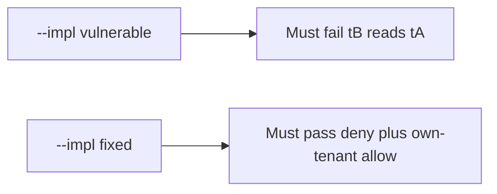

# 3.3-LO-05 — Evidence is tB-denied-tA, then a passing pair

**Kind:** verification-lab
**Loop step:** 5 Verify
**Standards:** OWASP ASVS 5.0.0 (final) `v5.0.0-8.4.1`.

## An invariant that cannot fail a test is still a slogan

“We have RLS in the backlog” is not evidence. “Private subnet” is a topology observation. The oracle is: `can_select("app", "tB", "tA") is False`. That observation must be **false** on `--impl vulnerable` (the helper returns true) and **true** on `--impl fixed`.

## Mental model: vulnerable must fail: tB reads tA

The failing observation on `--impl vulnerable` is **tB reads tA**. A passing collection count is not this cell.



| Mode | Must show for this module |
|---|---|
| Normal | After the fix, `can_select("app", "tA", "tA") is True` |
| Negative / abuse | `can_select("app", "tB", "tA") is False`; vulnerable must fail that assertion |
| Plane | migrator cannot SELECT at runtime; connection is not `postgres` |
| Not claimed | Production RLS; replica fleet; SQLi complete (6.1) |

Lab tests in `labs/3.3/3.3-lab/tests/test_property.py`. `test_app_role_cannot_read_other_tenant` is a **forbidden-outcome** test: a shared app role reading tA as tB is not allowed to count as a passing control.

```text
python3 -m pytest labs/3.3/3.3-lab/tests --impl vulnerable
python3 -m pytest labs/3.3/3.3-lab/tests --impl fixed
```

Map each test to an LO-02 cell. If vulnerable does not fail the cross-tenant assertion, the lab is miswired—fix the wiring, not the assertion.

## What the tests do not prove

- SQLi (6.1) beyond the forgotten-WHERE analogy
- Table-owner / `SECURITY DEFINER` bypass (E5)
- Billing replica (transfer)
- Kubernetes NetworkPolicy
- That 1.2 handler checks are present (they remain required)

Record those as residuals or later modules, not as silent passes.

## Practice

Execute both implementations this session. Write the fail/pass pair next to the matrix row. Reject a “test” that only greps `GRANT` in a migration without calling `can_select`.

## Transfer

Serverless admin string. A test that only asserts HTTP 200 is not architecture evidence (see 9.3). A test that connects to live RDS is out of scope.

## Non-goals

Do not add a live database. Do not log note bodies. Keys stay out of this file.
