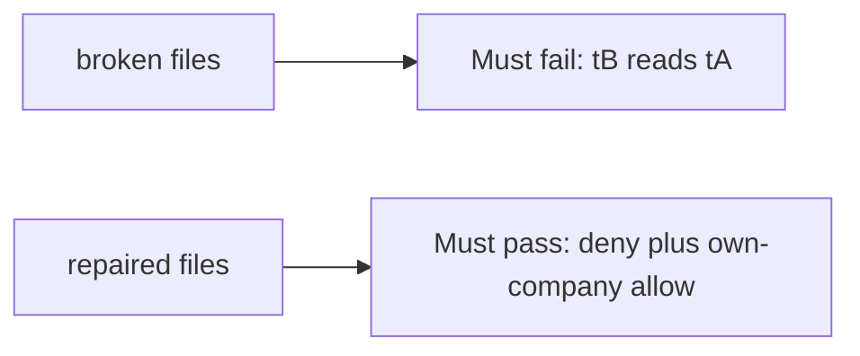

# The broken files must fail when company B reads company A

**Kind:** verification-lab
**Loop step:** 5 Verify

## Check it

A backlog ticket for row-level security does not stop the select. A private subnet is topology. `can_select("app", "tB", "tA")` has to be False. Leftover: app on tB can still select tA. Repair returns false.

## Picture: broken must fail — tB reads tA

tB can still read tA even when the suite is green. Repaired files still have to deny the other company and still allow own-company read.



| Mode | Must show for this topic |
|---|---|
| Normal | After the fix, `can_select("app", "tA", "tA") is True` |
| Wrong input / abuse | `can_select("app", "tB", "tA") is False`; broken files must fail that check |
| When things break | migrator cannot SELECT at runtime; connection is not `postgres` |
| Not claimed | Production row-level security; replica fleet; SQL injection complete |

`labs/3.3/3.3-lab/tests/test_property.py` is the check file. Watch `test_app_role_cannot_read_other_tenant` go red when a shared app role reads tA as tB.

```text
python3 -m pytest labs/3.3/3.3-lab/tests --impl vulnerable
python3 -m pytest labs/3.3/3.3-lab/tests --impl fixed
```

Map each test to a row you wrote on the compartments page. Do not paste keys. If the broken files do not fail the cross-company check, the lab is miswired — fix the wiring, not the check. A setup error is not proof the rule holds.

## What the tests do not prove

- SQL injection beyond the forgotten-WHERE analogy
- Table-owner / function-as-owner walk-around (later topic)
- Billing replica (transfer)
- Kubernetes network policy
- That who-is-allowed handler checks are present (they remain required)

## Practice

Call `can_select`. A `GRANT` line in a migration is a role, not the select.

## Use it somewhere new

A serverless admin string. Asserting HTTP 200 is not architecture evidence. Do not run a test that connects to a live cloud database.

## What this page is not doing

Do not add a live database. Do not log note bodies. Answer keys are not on this site.
