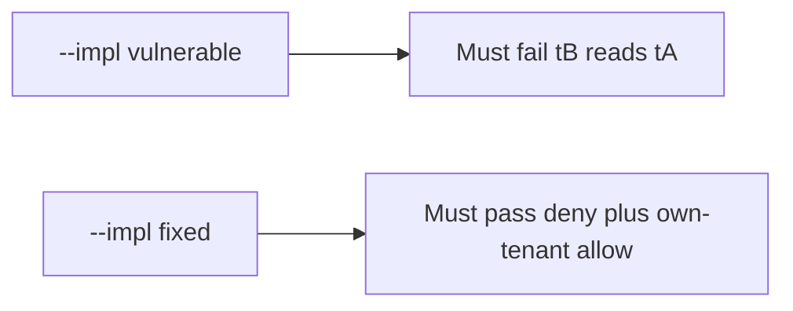

# 3.3-LO-05 — Evidence is tB-denied-tA, then a passing pair

**Kind:** verification-lab
**Loop step:** 5 Verify
**Standards:** OWASP ASVS 5.0.0 (final) `v5.0.0-8.4.1`.

## An invariant that cannot fail a test is still a slogan

“We have RLS in the backlog” is not evidence. The oracle is the local pair.

## Mental model: fail-on-vulnerable, pass-on-fixed



| Case | Must show |
|---|---|
| Negative / abuse | `can_select("app", "tB", "tA") is False` |
| Normal | own tenant still allowed |
| Plane | migrator not a runtime SELECT; connection not `postgres` |
| Not claimed | Production RLS; replica fleet |

Lab tests in `labs/3.3/3.3-lab/tests/test_property.py`:

```
python3 -m pytest labs/3.3/3.3-lab/tests --impl vulnerable
python3 -m pytest labs/3.3/3.3-lab/tests --impl fixed
```

## What the tests do not prove

- SQLi (6.1) beyond the forgotten-WHERE analogy
- Table-owner bypass
- Billing replica (transfer)

## Practice

Execute both implementations. Map each test to an LO-02 cell.

## Transfer

Serverless admin string. A test that only asserts HTTP 200 is not architecture evidence (see 9.3).
