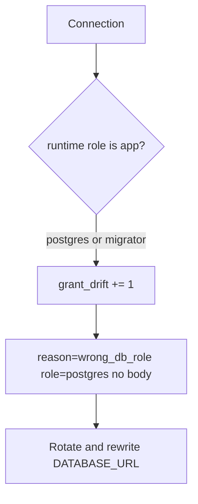

# 3.3-LO-06 — Detect grant drift; rotate without logging bodies

**Kind:** operations-exercise
**Loop step:** 6 Operate
**Standards:** NIST CSF 2.0 (final) DE/RS/RC as outcome labels; OWASP ASVS 5.0.0 (final) `v5.0.0-8.4.1`.

## Prevention is not absolute

A migration can leave `GRANT ALL` on the runtime user. A pooler can switch to `postgres`. Pair detect and recover. Do not log note bodies (3.1).

## Mental model: who connected, then rotate



| Outcome | This module |
|---|---|
| Detect | `grant_drift` in CI; connection-user metric |
| Signal | role name, request id; never the body |
| Recover | Rotate password; fix `GRANT`; take migrator offline |
| Residual | Stolen `app` still reads one tenant; document that cell |

## Practice

Write one log line you would accept. Tie it to `labs/3.3/3.3-lab`.

```
log_denied reason=wrong_db_role role=postgres request_id=req_33ar
```

Reject any line that includes a note body.

## Transfer

Serverless: detect the function using the migrate secret. Clinic replica: detect `SELECT *` from billing onto chart text.

## Non-goals

SIEM product names are not the property.
