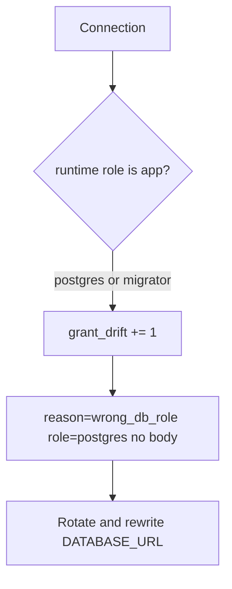

# Notice grant drift; rotate without logging bodies

**Kind:** operations-exercise
**Loop step:** 6 Operate

## Fixing it once is not enough

A migration can leave `GRANT ALL` on the runtime user, and a pooler can switch to `postgres`. Keep note bodies and company dumps out of the ticket while you investigate.

## Picture: who connected, then rotate



A broken grant must not put the note in the log.

| Outcome | This topic |
|---|---|
| Notice | `grant_drift` in CI; who connected; the local pair still red then green |
| What the line holds | role name, request id; never the body |
| Recover | Rotate password; fix `GRANT`; take migrator offline |
| Leftover | Stolen `app` still reads one company; write that rule down |

A log line does not configure `GRANT`. A cross-company SELECT still has to fail `test_app_role_cannot_read_other_tenant`.

The migrate job is leftover you must keep named: it exists, it is offline at request time, and a leaked migrate secret is a different owner than a leaked `app` password. Do not collapse those two alerts into “database issue.”

## What the framework does vs what you still have to check

Cloud IAM dashboards will show “database in a private subnet” and stay silent when the connection user is `postgres`. Notice must observe the **runtime role**, not the private network. Leave the note body out of the IAM metric.

## Practice

```text
log_denied reason=wrong_db_role role=postgres request_id=req_33ar
```

A note body, a real connection-string secret, or “VPC is isolation” is too much for that deny line.

## Use it somewhere new

Serverless: notice the function using the migrate secret. Clinic replica: notice `SELECT *` from billing onto chart text. Do not connect to those systems.

## What this page is not doing

Do not use live GRANT dumps. This site does not mark you as finished. Answer keys are not on this site.
