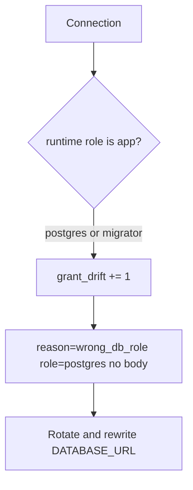

# 3.3-LO-06 — Detect grant drift; rotate without logging bodies

**Kind:** operations-exercise
**Loop step:** 6 Operate
**Standards:** NIST CSF 2.0 (final) DE/RS/RC as outcome labels; OWASP ASVS 5.0.0 (final) `v5.0.0-8.4.1`. CSF names outcomes; it does not configure `GRANT`.

## Prevention is not absolute

A migration can leave `GRANT ALL` on the runtime user. A pooler can switch to `postgres`. Pair detect and recover. Do not log note bodies (3.1). Do not paste a tenant dump into the ticket while investigating.

## Mental model: who connected, then rotate



| Outcome | This module |
|---|---|
| Detect | `grant_drift` in CI; connection-user metric |
| Signal | role name, request id; never the body |
| Recover | Rotate password; fix `GRANT`; take migrator offline |
| Residual | Stolen `app` still reads one tenant; document that cell |

CSF 2.0 Detect / Respond / Recover name outcomes. They do not prove `v5.0.0-8.4.1`. A SIEM product name is not the property. Re-run `test_app_role_cannot_read_other_tenant` after any GRANT change; a green IAM dashboard is not that pytest.

The migrator plane is a residual you must keep named: it exists, it is offline at request time, and a leaked migrate secret is a different owner than a leaked `app` password. Do not collapse those two alerts into “database issue.”

## Framework defaults versus the operate guarantee

Cloud IAM dashboards will show “RDS in a private subnet” and stay silent when the connection user is `postgres`. Detection must observe the **runtime role**, not the VPC. If the alert includes a note body, you have opened a 3.1 cell.

## Practice

Write one log line you would accept. Tie it to `labs/3.3/3.3-lab`.

```text
log_denied reason=wrong_db_role role=postgres request_id=req_33ar
```

Reject any line that includes a note body, a real connection string secret, or “VPC is isolation.”

## Transfer

Serverless: detect the function using the migrate secret. Clinic replica: detect `SELECT *` from billing onto chart text. Do not connect to those systems.

## Non-goals

SIEM product names are not the property. Live GRANT dumps are out of scope. Gates 0–10 stay not-attempted.
