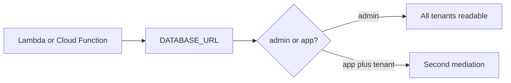

# 3.3-LO-07 — Transfer: serverless admin string and clinic replica

**Kind:** transfer-challenge
**Loop step:** 7 Transfer
**Standards:** OWASP ASVS 5.0.0 (final) `v5.0.0-8.4.1`; Saltzer and Schroeder (1975, seminal) least privilege. CISA Secure by Design remains **unverified** in this pin set.

## Change the plane; keep two mediations

Do not answer with a Top 10 / CWE / scanner as the definition of security. The SecureCollab sentence was: `can_select("app", "tB", "tA") is False`. Rewrite it for a new compute shape without changing the fork.

**Prompt:** Serverless function with a shared `admin` connection string.

**Product sketch:** Clinic billing replica that should see invoice rows, not chart text.

Rewrite the SecureCollab sentence. Include:

1. attacker capabilities (stolen function secret; forgotten handler filter; replica user with `SELECT` on notes — **not** a live clinic, Lambda, or RDS);
2. trust assumptions (which role is TCB; the cloud vendor IAM name is not);
3. forbidden outcome (`admin` can read tA notes, or billing replica can read chart text — pick one);
4. a test idea on a **local** fixture only (`can_select` analogue);
5. residual (IAM admin still exists; RLS owner bypass; CISA pin unverified);
6. WCAG 2.2 only if a human-mediated control is in the claim (role design itself is not a WCAG problem).

## Mental model: a new compute shape is still a role

Microservices and serverless do not add a tenant predicate by existing. A private subnet does not compare `tB` to `tA`. The replica is a second plane: invoice rows may be in-scope for billing; chart text is not.

## What graders reject

| Reject | Why |
|---|---|
| “Private subnet” as the property | Topology ≠ isolation |
| Live clinic or real RDS | Lab policy |
| RLS ticket without a test | Mechanism theater |
| CISA pledge as GRANT | Unverified living guidance |
| HTTP 200 as architecture evidence | Wrong observation |

## Practice

One page. No keys. `labs/3.3/3.3-lab` is the only running system you may break. Do not deploy a function or open a replica.

## Non-goals

Live-target SQL. Real tenant dumps. Claiming Gate 3 from this page.
