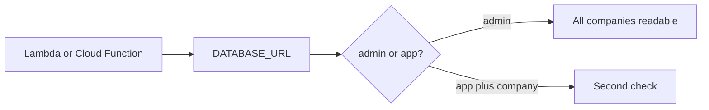

# Same idea on a serverless admin string and a clinic replica

**Kind:** transfer-challenge
**Loop step:** 7 Transfer

## Use it somewhere new

You get a **serverless function with a shared `admin` connection string**, or a **clinic billing replica** that should see invoice rows, not chart text. `can_select("app", "tB", "tA") is False`.

Serverless function with a shared `admin` connection string.

Clinic billing replica that should see invoice rows, not chart text.

1. who might try (stolen function secret; forgotten handler filter; replica user with `SELECT` on notes — **not** a live clinic, cloud function, or managed database);
2. what you trust (which role is the second check; the cloud vendor IAM name is not);
3. what must not happen (`admin` can read tA notes, or billing replica can read chart text — pick one);
4. a check on a **local** practice only (`can_select` analogue);
5. leftover (IAM admin still exists; table-owner walk-around of a later row-level rule; a living pledge we have not verified here is not GRANT);
6. whether a human path must meet the web accessibility baseline (role design itself is not an accessibility problem; skip unless you claim a human-mediated control).

## Picture: a new compute shape is still a role

Treat the clinic function as the notes-app process. A shared `admin` string and a billing replica that can read chart text are new rules. Microservices and serverless still do not add a same-company check by existing.

A private subnet does not compare `tB` to `tA`. The replica is a second lane: invoice rows may be in-scope for billing; chart text is not.

## What is not good enough

| Reject | Why |
|---|---|
| “Private subnet” as the rule | Topology is not isolation |
| Live clinic or real managed database | Course rules |
| Row-level-security ticket without a test | Tool theater |
| A manufacturer pledge as GRANT | Living guidance, not this check |
| HTTP 200 as architecture evidence | Wrong observation |

## Practice

Write one page. Leave the keys closed. `labs/3.3/3.3-lab` is the only running system you may break. Do not deploy a function or open a replica.

## What this page is not doing

Do not try live-target SQL. Do not use real company dumps. This page does not finish a check-in.
