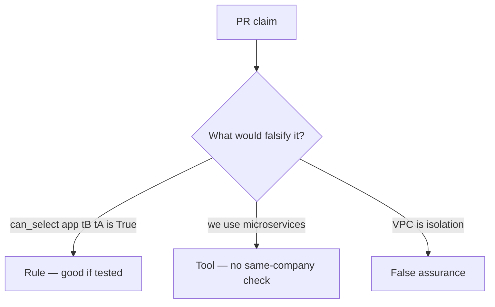

# Review of an all-powerful runtime role

**Kind:** code-review
**Loop step:** Review

Wait until someone has looked at your review before opening the keys.

## What you are reviewing

Review `labs/3.3/3.3-lab/vulnerable/` as a change to the notes app’s database role. Check whether `can_select("app", "tB", "tA")` is still true.

The check you already ran (`test_app_role_cannot_read_other_tenant`) is the rule test. A comment “row-level security later” is not.

## Picture: DATABASE_URL uses superuser

**`DATABASE_URL` uses superuser**.

tB still cannot SELECT tA. If the change never checks the same company, that leftover path is still open.

## Problems to find (name them yourself)

- `DATABASE_URL` uses superuser
- Comment “row-level security later” in the production path
- Analytics role `SELECT *`
- No test that `can_select("app", "tB", "tA") is False`

Also reject: treating the client as what you trust; closing findings without re-running `test_app_role_cannot_read_other_tenant`; keys in learner notes; real personal data in practice files; a manufacturer pledge as GRANT.

## Common mix-ups

- Microservices are automatically isolated
- A later row-level rule replaces who-is-allowed (the handler check remains required)
- A private network is company isolation
- SQLAlchemy session is the same-company check
- A managed-database product name is the second check

## Practice

Write three notes a maintainer could act on, and tie at least one to `test_app_role_cannot_read_other_tenant`. For each: what you saw, whether it is a rule or false assurance, a structural change, leftover you will **not** delete.

## Use it somewhere new

A serverless change that “uses a managed database” without a same-company check is an incomplete review. Name the independent falsehood that would still keep `tB` from reading `tA`.

## What this page is not doing

Do not merge by adding a comment “row-level security later.” That comment is leftover risk without an owner. Do not connect to a live cloud database to prove the finding.
