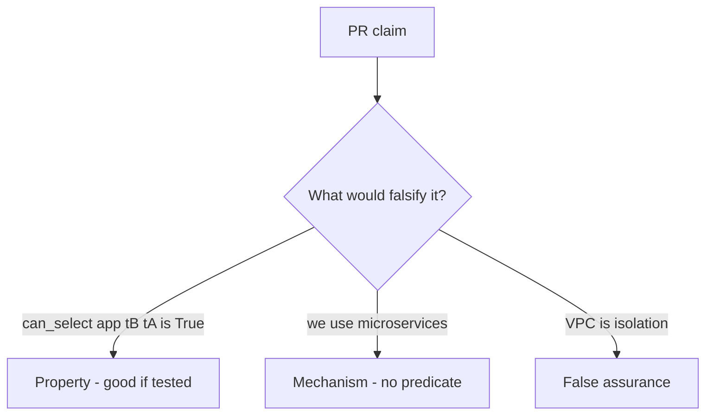

# 3.3-LO-08 — Review the omnipotent role as a PR, not a diagram

**Kind:** code-review
**Loop step:** Review
**Standards:** OWASP ASVS 5.0.0 (final) `v5.0.0-8.4.1`.

## Review the fixture as if it were SecureCollab’s DB role

Review `labs/3.3/3.3-lab/vulnerable/` as a SecureCollab PR. Intended findings live only in `content/assessment/keys/3.3.md` — not here.

## Mental model: DATABASE_URL uses superuser

Start with this seeded smell: **`DATABASE_URL` uses superuser**. Label it property, mechanism, or false assurance before you accept the PR.

Seeded smells (label them yourself; do not open the keys file):

- `DATABASE_URL` uses superuser
- Comment “RLS later” in the production path
- Analytics role `SELECT *`
- No test that `can_select("app", "tB", "tA") is False`

Also reject: client trust, closing findings without retest, keys in lessons, real PII in fixtures.

## Misconceptions

- Microservices are automatically isolated
- RLS replaces application authz
- Network VPC is tenant isolation

## Practice

Write three review notes. Tie at least one to `test_app_role_cannot_read_other_tenant`.

## Transfer

Serverless PR that “uses a managed database” without a tenant predicate is incomplete.
