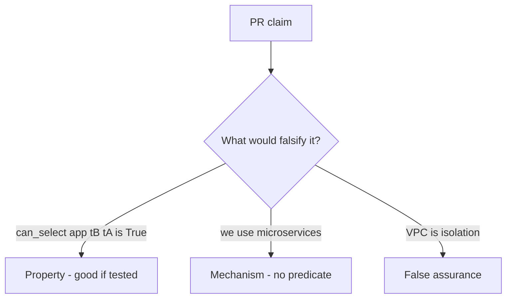

# 3.3-LO-08 — Review the omnipotent role as a PR, not a diagram

**Kind:** code-review
**Loop step:** Review
**Standards:** OWASP ASVS 5.0.0 (final) `v5.0.0-8.4.1`. CISA Secure by Design remains **unverified**.

## Review the fixture as if it were SecureCollab’s DB role

Review `labs/3.3/3.3-lab/vulnerable/` as a SecureCollab PR. Your job is not to count suspicious lines. Reconstruct whether `can_select("app", "tB", "tA")` is still true, compare that with the module invariant, and write changes a developer can verify.

Intended findings live only in `content/assessment/keys/3.3.md` — not here. Do not open the keys file until your review has been evaluated.

## Mental model: DATABASE_URL uses superuser

Start with this seeded smell: **`DATABASE_URL` uses superuser**. Label it property, mechanism, or false assurance before you accept the PR.

Classification starts at the protected effect (tB cannot SELECT tA). Everything that is not a tenant predicate at that call is a candidate ambient path.

## Seeded smells (label them yourself)

- `DATABASE_URL` uses superuser
- Comment “RLS later” in the production path
- Analytics role `SELECT *`
- No test that `can_select("app", "tB", "tA") is False`

Also reject: client trust; closing findings without re-running `test_app_role_cannot_read_other_tenant`; keys in lessons; real PII in fixtures; CISA pledge as GRANT.

## Misconceptions this module refuses

- Microservices are automatically isolated
- RLS replaces application authz (1.2 remains required)
- Network VPC is tenant isolation
- SQLAlchemy session is the predicate
- A managed database product name is the second mediation

## Practice

Write three review notes a maintainer could act on. Each note: observation, property or false assurance, suggested structural change, residual you will **not** delete. Tie at least one to `test_app_role_cannot_read_other_tenant`.

## Transfer

Serverless PR that “uses a managed database” without a tenant predicate is an incomplete mediation review. Name the independent falsehood that would still keep `tB` from reading `tA`.

## Non-goals

Do not merge by adding a comment “RLS later.” That comment is a residual without an owner. Do not connect live RDS to prove the finding.
