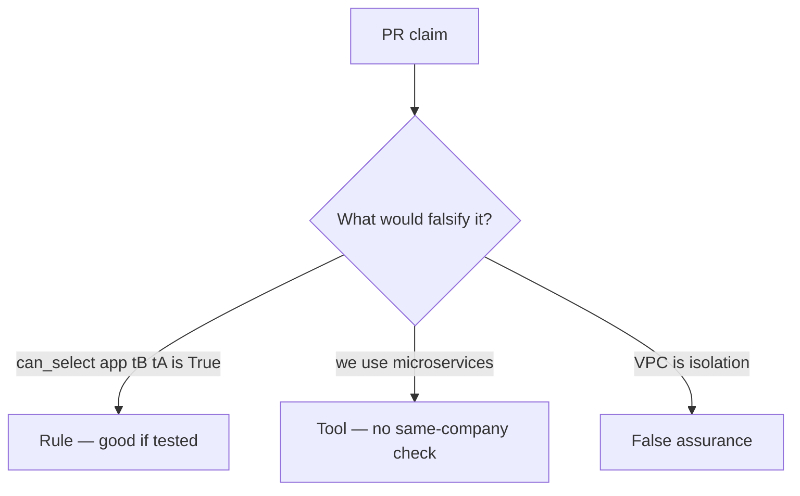

# Review of an all-powerful runtime role

**Kind:** code-review
**Loop step:** Review

## What you are reviewing

Open `labs/3.3/3.3-lab/vulnerable/` as if it were a database-role PR. Does `can_select("app", "tB", "tA")` still return true?

“Row-level security later” does not close `test_app_role_cannot_read_other_tenant`.

## Picture: DATABASE_URL uses superuser

**`DATABASE_URL` uses superuser**.

tB still cannot SELECT tA. A role that is not bound to the same company still reads across tenants.

## Problems to find (name them yourself)

- `DATABASE_URL` uses superuser
- Comment “row-level security later” in the production path
- Analytics role `SELECT *`
- No test that `can_select("app", "tB", "tA") is False`

Also reject: treating the client as what you trust; closing findings without re-running `test_app_role_cannot_read_other_tenant`; keys in learner notes; real personal data in practice files; a manufacturer pledge as GRANT.

## Common mix-ups

- Microservices are automatically isolated
- A later row-level rule replaces who-is-allowed (the handler check remains required)
- A private network is company isolation
- SQLAlchemy session is the same-company check
- A managed-database product name is the second check

## Use it somewhere new

A managed database without a same-company check still lets `tB` read `tA`. A managed database is not a same-company check — write the `tB`-read-`tA` deny.

## What this page is not doing

If the change never checks the same company, “row-level security later” is not a merge. Do not connect to a live cloud database to prove the finding.
