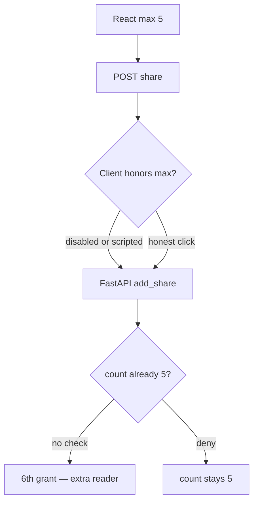
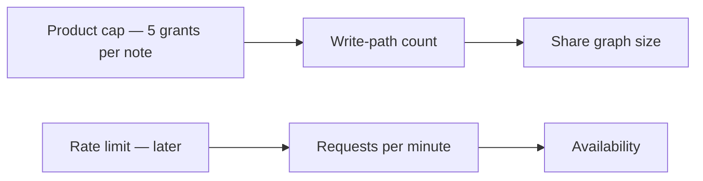

# The product cap lives on the write path, not in the UI

**Kind:** concept-model
**Loop step:** 1 Property

## The rule

The notes app lets an owner share a note with other people. The product rule is **at most five share grants per note**. That number is a business limit on who may later read the note, not a named bug. A scripted client, a disabled `max=5` select, an import path, or eight rapid POSTs will try to add a sixth reader. HTML is not what you trust.

> For a note in the notes app, eight `add_share` calls must leave `share_count() <= 5`. The sixth grant is denied on the **write path**. A React `max={5}`, a CDN filter, or a famous-bugs sticker is not the write-path limit.

What must not happen is **cap exceeded**: looping `add_share()` eight times yields `last > 5`. Extra rows are extra readers nobody intended: more people on the note, more places a break can reach, a noisier threat model.

The limit has to be written down, enforced on a trusted service, actually implemented, and locked so two parallel sixths cannot both land. Multi-user approval for a support override is an advanced extra, not a silent baseline. A famous-bugs list may mention unrestricted consumption after this sentence exists. That list is not the syllabus.

## Picture: UI max is not the write path



Nobody needs a new bug name. A loop, a retrying UI, or a support tool is enough. Trusting “the owner will stop at five” is not what you trust.

HTML `max`, nginx `limit_req`, or a filter named after an awareness list is not this check.

## Picture: rate limit is not the product cap



A client that adds five grants slowly still must stop at five. A client that hammers `/share` with the same key is a retry problem from earlier. A client that hammers many notes is a rate-limit problem later. Mixing those three slogans hides the test.

## Why it happens, what it costs, how you stop it, how you notice, how you recover

| Slice | For this rule |
|---|---|
| Why it happens | Policy only in the UI |
| What's already wrong | `add_share` increments with no cap |
| Trigger | Eight rapid POSTs or a disabled max |
| What it costs | Integrity of the share policy; extra readers on the note |
| How you stop it | Check count in the same write as insert; reject the 6th |
| How you notice | `share_cap_denied`; anomaly on one note |
| How you recover | Trim extra grants; tell the owner; do not log bodies |

## What the framework does vs what you still have to check

FastAPI does not know “five members.” SQLAlchemy `add()` will insert a sixth row. An accessible “share limit reached” message is something people can hear; that is not the cap. After eight `add_share` calls, `last <= 5`, and five honest shares still succeed — files in `labs/3.4/3.4-lab`. No live tenants.

## What the tool cannot do

- Cap on `/share` but not `/import` or GraphQL.
- Parallel sixths before commit (needs a transaction or lock — leftover from the retry lab).
- Support override with no audit (advanced, not this check).

## Practice

Draw the state machine `0..5`; 6th denied. Then run:

```text
python3 -m pytest labs/3.4/3.4-lab/tests --impl vulnerable
python3 -m pytest labs/3.4/3.4-lab/tests --impl fixed
```

Tie the check to count ≤ 5, not to a filter product name.

## Use it somewhere new

Max 3 guardians per child. Invite tokens and export quotas are different objects, same shape.

## Can people still use it

Error “share limit reached” must be something assistive tech can announce, not only a red border. Announcing it does not enforce the cap.

## What this page is not doing

Do not try live-target load tests, real member emails, weaponized bots, and “business logic is not security.” Answer keys are not on this site.
