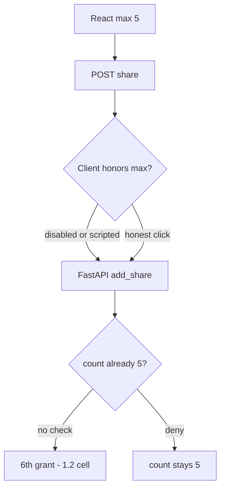
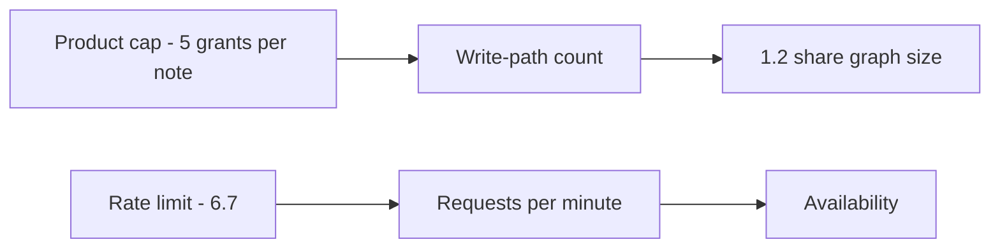

# 3.4-LO-01 — The product cap lives on the write path, not in the UI

**Kind:** concept-model
**Loop step:** 1 Property
**Standards:** OWASP ASVS 5.0.0 (final) `v5.0.0-2.1.3`, `v5.0.0-2.2.2`, `v5.0.0-2.3.2`, and `v5.0.0-2.3.4`; `v5.0.0-2.3.5` is **Level 3, advanced** (multi-user approval for overrides). OWASP API Security Top 10:2023 API4/API6 are **awareness** only. WCAG 2.2 (final) Success Criterion 4.1.3 Status Messages for “share limit reached.”

## The claim this module owns

SecureCollab Phase 1 lets an owner share a note with other principals (1.2). The product rule is **at most five share grants per note**. That number is a business-logic limit, not a CVE. A scripted client, a disabled `max=5` select, an import path, or eight rapid POSTs (2.4) will try to add a sixth reader. HTML is not a TCB.

> For a SecureCollab Phase 1 note, eight `add_share` calls must leave `share_count() <= 5`. The sixth grant is denied on the **write path**. A React `max={5}`, a CDN WAF, or API4 as a sticker is not this sentence.

The forbidden outcome is **cap exceeded**: looping `add_share()` eight times yields `last > 5`. Extra rows are 1.2 cells nobody intended: more readers, a larger blast radius, a noisier threat model (3.2).

ASVS `v5.0.0-2.1.3` wants the limit documented (per-note cap 5). `v5.0.0-2.2.2` wants enforcement at a trusted service layer — the client may help usability but must not be the control. `v5.0.0-2.3.2` wants the documented limit actually implemented. `v5.0.0-2.3.4` wants locking so two parallel sixths cannot both land (the 2.4 retry lab is the same *shape*; this lab’s oracle is count under a loop). `v5.0.0-2.3.5` is **Level 3 (advanced)** if support may override the cap — not a silent baseline. API4/API6 name unrestricted consumption and sensitive flows as awareness after this sentence, not as the syllabus.

## Mental model: UI max is not the write path



The attacker is not a novel CWE. It is a **loop**, a retrying UI (2.4), or a support tool. Trusting “the owner will stop at five” is not a TCB.

**Mechanism (not the property):** HTML `max`, nginx `limit_req`, or a WAF rule named API4.

## Mental model: rate limit is not the product cap



A client that adds five grants slowly still must stop at five. A client that hammers `/share` with the same key is 2.4. A client that hammers many notes is 6.7. Mixing those three slogans hides the test.

## Root cause vs impact vs prevention vs detection vs recovery

| Slice | For this property |
|---|---|
| Root cause | Policy only in the UI |
| Preconditions | `add_share` increments with no cap |
| Trigger | Eight rapid POSTs or a disabled max |
| Impact | Integrity of the share policy; extra 1.2 readers |
| Prevention | Check count in the same write as insert; reject 6th |
| Detection | `share_cap_denied`; anomaly on one note |
| Recovery | Trim extra grants; notify owner; do not log bodies |

## Framework defaults versus the cap guarantee

FastAPI does not know “five members.” SQLAlchemy `add()` will insert a sixth row. WCAG 4.1.3 wants the denial announced to assistive tech; that is not the cap. The lab guarantee: after eight `add_share` calls, `last <= 5`, and five honest shares still succeed. Oracle: `labs/3.4/3.4-lab`. No live tenants.

## Mechanism limits

- Cap on `/share` but not `/import` or GraphQL.
- Parallel sixths before commit (needs a transaction/lock — 2.4 / `v5.0.0-2.3.4`).
- Support override with no audit (`v5.0.0-2.3.5` advanced).

## Practice

Draw the state machine `0..5`; 6th denied. Then run:

```
python3 -m pytest labs/3.4/3.4-lab/tests --impl vulnerable
python3 -m pytest labs/3.4/3.4-lab/tests --impl fixed
```

The first command must fail. The second must pass. Map the assertion to count ≤ 5, not to a WAF product name.

## Transfer

Clinic: max 3 guardians per child. Invite tokens (6.6) and export quotas (6.7) are different objects, same shape.

## Non-goals

Live-target load tests, real member emails, weaponized bots, and “business logic is not security.” Gates 0–10 and milestones M0–M5 stay **not-attempted** without learner or product evidence. Answer keys are not in this file.

## Usability and accessibility

Error “share limit reached” must be programmatically announced (WCAG 2.2 Success Criterion 4.1.3), not only a red border. Announcing it does not enforce the cap.
