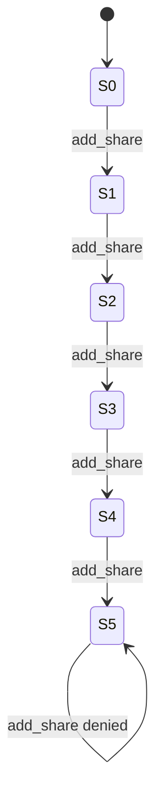
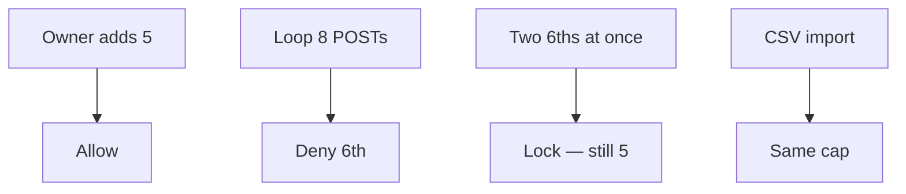

# A state machine someone else can test

**Kind:** design-exercise
**Loop step:** 2 Model

## Could someone else name checks from your machine?

“We have a share limit” is not this page. A reviewable model names **states 0–5**, **the 6th transition**, **who may override**, and **which paths skip the cap**.

This week: one note, `add_share` counter, cap 5. No live GraphQL, no production filter.

## Picture: five allowed, sixth is a different rule

If `S5 --> S6` exists on any channel, the rule is false. Import, support, and workers are channels.

## Picture: misuse cases that are still this product

## Step 1: name who, what, and when

| Piece | This system |
|---|---|
| Who | Owner; scripted client; support; import job |
| What | share count; cap=5; note id |
| Actions | `add_share` |
| Paths | API loop; UI; later import |
| What you trust | Server-side cap in the same transaction as insert |
| What you do not trust | Client `max=5`; disabled button |
| State / time | Eight rapid POSTs; lock contention |
| The rule | Integrity of the share policy |

## Step 2: write rows the lab can fail

| Who | What | Action | Decision |
|---|---|---|---|
| owner | shares 1–5 | add | allow |
| owner | share 6 | add | deny |
| script | parallel 6 | add | deny-with-lock |
| support | override | add | audited exception (advanced) |
| import | share 6 | add | deny |

## Step 3: abuse-control plan

Write the cap down. Implement it on every write. Do not substitute a later rate limit. Awareness-list names are regression labels after the machine exists.

## Practice

Open `share_limit.py` in `labs/3.4/3.4-lab`.

## Use it somewhere new

A clinic example: states `0..3` guardians. Invite tokens: one token ≠ unbounded redemption.

## What can still go wrong

Legitimate teams >5 need an owned exception. Parallel sixths need locking from the retry lab.

## What this page is not doing

Do not treat a famous-bugs list as the definition of security. Answer keys are not on this site.
