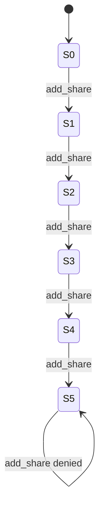
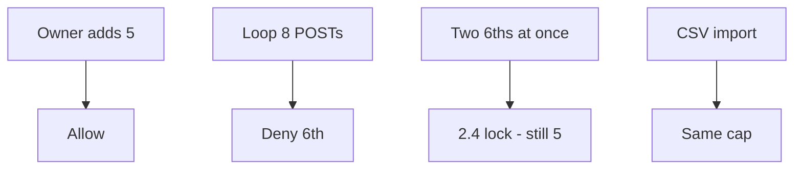

# 3.4-LO-02 — A state machine a second engineer can test

**Kind:** design-exercise
**Loop step:** 2 Model
**Standards:** OWASP ASVS 5.0.0 (final) `v5.0.0-2.1.3` and `v5.0.0-2.3.2`.

## Can a second engineer name pytest cases from your machine?

“We have a share limit” is not this lesson. A reviewable model names **states 0–5**, **the 6th transition**, **who may override**, and **which paths skip the cap**.

SecureCollab Phase 1 freeze: one note, `add_share` counter, cap 5. No live GraphQL, no production WAF.

## Mental model: five allowed, sixth is a different cell

If `S5 --> S6` exists on any channel, the property is false. Import, support, and workers are channels.

## Mental model: misuse cases that are still this product

## Step 1: freeze pieces

| Piece | This system |
|---|---|
| Subjects | Owner; scripted client; support; import job |
| Objects | share count; cap=5; note id |
| Actions | `add_share` |
| Channels | API loop; UI; later import |
| TCB | Server-side cap in the same transaction as insert |
| Untrusted | Client `max=5`; disabled button |
| State / time | Eight rapid POSTs; lock contention |
| 1.1 cell | Integrity of the share policy |

## Step 2: write cells

| Subject | Object | Action | Decision |
|---|---|---|---|
| owner | shares 1–5 | add | allow |
| owner | share 6 | add | deny |
| script | parallel 6 | add | deny-with-lock |
| support | override | add | audited exception (advanced) |
| import | share 6 | add | deny |

## Step 3: abuse-control plan

Document the cap (`v5.0.0-2.1.3`). Implement it on every write (`v5.0.0-2.3.2`). Do not substitute 6.7 rate limits. API4/API6 are regression labels after the machine exists.

## Practice

Draw this map so a second engineer could name pytest cases. Point at `labs/3.4/3.4-lab` file `share_limit.py`.

## Transfer

Clinic: states `0..3` guardians. Invite tokens: one token ≠ unbounded redemption (6.6).

## Residual risk

Legitimate teams >5 need an owned exception (E6). Parallel sixths need 2.4 locking.

## Non-goals

Top 10 / CWE-799 as the definition of security. Keys stay out of lessons.
