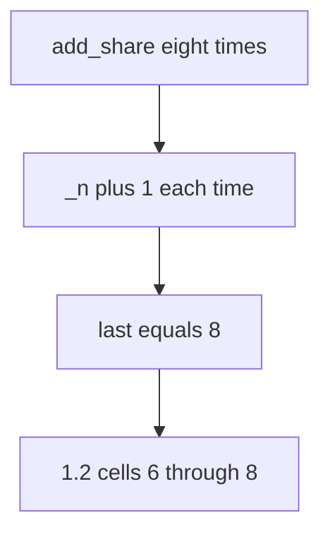

# 3.4-LO-03 — Observe the 6th grant, do not trophy a flood

**Kind:** mechanism-lab
**Loop step:** 3 Break
**Standards:** OWASP ASVS 5.0.0 (final) `v5.0.0-2.3.2`.

## Authorized scope

`labs/3.4/3.4-lab` only. Synthetic share counts. No live tenants.

**Forbidden outcome:** Share grants exceed the product cap of 5.

## Mental model: increment with no ceiling



The vulnerable tree demonstrates **cause** (policy only in the UI / no write-path check), not a trophy load test against a public API.

## What to read in the fixture

`vulnerable/share_limit.py` `add_share` always increments. The tests loop eight times and require `last <= 5`, require five honest shares to succeed, and require the sixth call not to increment.

## Root cause vs impact

| Slice | Lab |
|---|---|
| Root cause | Policy only in the UI |
| Impact | Unbounded readers; 1.2 matrix explodes |
| Not the lesson | API4 as a sticker or CWE-799 as the requirement |

## Practice

```
python3 -m pytest labs/3.4/3.4-lab/tests --impl vulnerable
```

Record `test_share_cap_is_enforced`. Do not weaken it to “a max attribute exists.”

## Transfer

Clinic: four `add_guardian` calls vs cap 3. Predict without leaving this directory.

## Non-goals

No live-target instructions. Synthetic data only.
