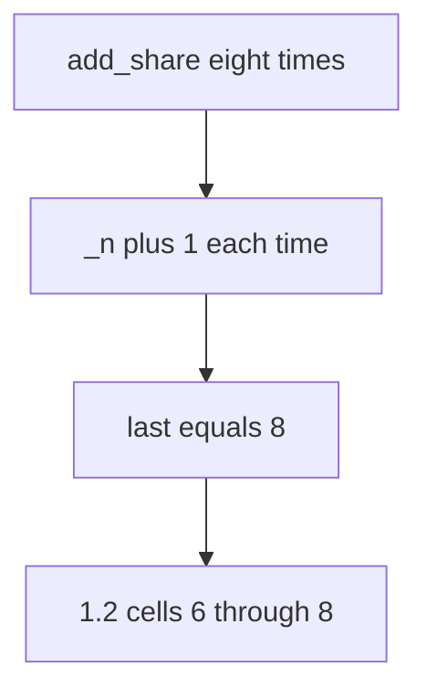

# 3.4-LO-03 — Observe the 6th grant, do not trophy a flood

**Kind:** mechanism-lab
**Loop step:** 3 Break
**Standards:** OWASP ASVS 5.0.0 (final) `v5.0.0-2.3.2`. API Top 10:2023 API4/API6 are **awareness** only, not this oracle.

## Authorized scope

`labs/3.4/3.4-lab` only. The fixture is an in-process `add_share` counter. Synthetic share counts. It does not open FastAPI, a CDN WAF, or a classmate API. Do not load-test a public host, an employer share endpoint, or a live clinic booking page.

**Forbidden outcome:** share grants exceed the product cap of 5. Looping `add_share()` eight times yields `last > 5`.

Attacker capability in this lab: a scripted client that can call `add_share` in a loop. That stands in for a disabled `max=5` select, an import path, or eight rapid POSTs (2.4). Trust assumption: the **write path** is supposed to deny the sixth grant. HTML, nginx `limit_req`, and a WAF rule named API4 are not in the TCB for this cell.

## Mental model: increment with no ceiling



The vulnerable tree demonstrates **cause** (policy only in the UI / no write-path check), not a trophy load test against a public API. Preconditions: `add_share` increments `_n` with no cap. You do not need eight HTTP clients. You must not flood a live API.

ASVS `v5.0.0-2.3.2` wants the documented limit actually implemented. A React `max={5}` is a usability hint, not that implementation.

## What to read in the fixture

`vulnerable/share_limit.py` `add_share` always increments and returns `_n`. Tests:

- `test_share_cap_is_enforced` — eight calls leave `last <= 5`
- `test_five_shares_are_allowed` — honest path still reaches 5
- `test_sixth_does_not_increment` — sixth call returns 5

You do not need a new note id. The failure of `test_share_cap_is_enforced` *is* the evidence.

Do not open the fixed tree yet. Diagnose the cause first.

## Root cause vs impact vs prevention vs detection vs recovery

| Slice | This lab |
|---|---|
| Required property | Eight `add_share` calls leave count ≤ 5 |
| Root cause | Policy only in the UI |
| Preconditions | `add_share` increments with no cap |
| Trigger | Eight rapid POSTs or a disabled max (modeled as a loop) |
| Impact | Integrity of the share policy; extra 1.2 readers; larger blast radius |
| Prevention | Check count in the same write as insert; reject 6th |
| Detection | `share_cap_denied`; anomaly on one note |
| Recovery | Trim extra grants; notify owner; do not log bodies |
| Not the lesson | API4 as a sticker, CWE-799 as the requirement, or a WAF product name |

## Framework defaults versus the cap guarantee

FastAPI does not know “five members.” SQLAlchemy `add()` will insert a sixth row. WCAG 4.1.3 wants the denial announced to assistive tech; that is not the cap. The application guarantee is: **this** fixture, after eight calls, `last <= 5`.

## Practice

```text
python3 -m pytest labs/3.4/3.4-lab/tests --impl vulnerable
```

Record `test_share_cap_is_enforced`. Do not weaken it to “a max attribute exists.” An environment error is not security evidence.

## Transfer

Clinic: four `add_guardian` calls vs cap 3. Predict without leaving this directory. Do not hit a clinic API.

## Usability

Error “share limit reached” must be programmatically announced (WCAG 2.2 Success Criterion 4.1.3), not only a red border. Announcing it does not enforce the cap.

## Non-goals

No live-target load tests. Synthetic counts only.
