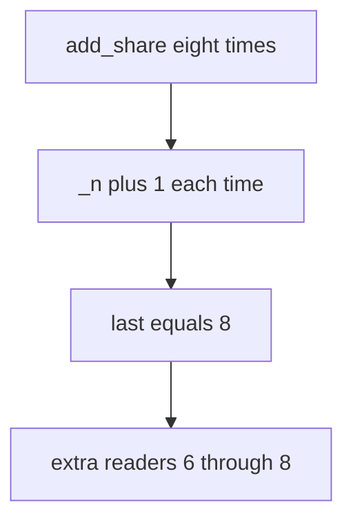

# Practice: share grants go past the cap of 5

**Kind:** mechanism-lab
**Loop step:** 3 Break

## Try it

The practice is not a website you attack. `add_share` uses fake share counts. It does not open FastAPI, a CDN filter, or a classmate API. Extra grants are already the break; you do not need a load test.

> Eight `add_share` calls must leave count ≤ 5. Share grants must not go past the product cap of 5.

## Where you may practice

Stay inside `labs/3.4/3.4-lab`. Restore the broken and repaired folders when you are done. Fake counts only.

Do not load-test a public host, an employer share endpoint, or a live clinic booking page.

What must not happen: share grants exceed the product cap of 5. Looping `add_share()` eight times yields `last > 5`.

Who could do this: a **scripted client** that can call `add_share` in a loop. That stands in for a disabled `max=5` select, an import path, or eight rapid POSTs. What is supposed to stop this: the **write path** denies the sixth grant. HTML, nginx `limit_req`, and a filter named after an awareness list are not enough.

## Picture: increment with no ceiling



The broken files show **cause** (policy only in the UI / no write-path check), not a load test against a public API. What has to be true first: `add_share` increments `_n` with no cap. You do not need eight HTTP clients. You must not flood a live API.

A React `max={5}` is a usability hint, not that implementation.

## What to look at: the cause, not a hunt

In `vulnerable/share_limit.py`, `add_share` always increments and returns `_n`. Checks:

- `test_share_cap_is_enforced` — eight calls leave `last <= 5`
- `test_five_shares_are_allowed` — honest path still reaches 5
- `test_sixth_does_not_increment` — sixth call returns 5

You do not need a new note id.
## Why it happens, what it costs, how you stop it, how you notice, how you recover

| Slice | This practice |
|---|---|
| The rule | Eight `add_share` calls leave count ≤ 5 |
| Why it happens | Policy only in the UI |
| What has to be true first | `add_share` increments with no cap |
| Trigger | Eight rapid POSTs or a disabled max (modeled as a loop) |
| What it costs | Integrity of the share policy; extra readers; more places a break can reach |
| How you stop it | Check count in the same write as insert; reject the 6th |
| How you notice | `share_cap_denied`; anomaly on one note |
| How you recover | Trim extra grants; tell the owner; do not log bodies |
| Not the lesson | An awareness-list sticker, a weakness nickname as the requirement, or a filter product name |

## What the framework does vs what you still have to check

FastAPI does not know “five members.” SQLAlchemy `add()` will insert a sixth row. An accessible denial is not the cap. After eight calls, `last <= 5`.

## Practice

```text
python3 -m pytest labs/3.4/3.4-lab/tests --impl vulnerable
```

Do not weaken it to “a max attribute exists.” A setup error is not proof the rule holds.

## Use it somewhere new

A clinic example: four `add_guardian` calls vs cap 3. Predict without leaving this directory. Do not hit a clinic API.

## Can people still use it

Error “share limit reached” must be something assistive tech can announce, not only a red border. Announcing it does not enforce the cap.

## What this page is not doing

No live-target load tests. Fake counts only. Do not “fix” the practice by deleting the check.
