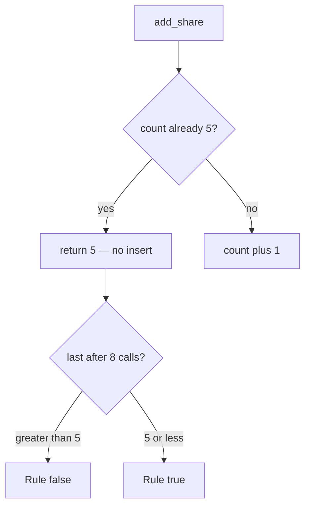

# Check the count on the same write as the insert

**Kind:** design-exercise
**Loop step:** 4 Build

## The rule

`add_share` must not increment when `_n >= 5`. Structural means the **server write path** compares count to cap — not HTML `max`, not a filter, not “the owner will stop,” not a rate limit.

The smallest restore for notes-app share is: if count is already 5, return 5 and do not insert. Fail closed: if the count store is uncertain, **deny** the 6th. Five honest shares still succeed.

## Picture: deny at five, keep the count



The lab’s repaired files use `MAX = 5` and return `_n` when the ceiling is hit. Production should check count in the **same transaction** as insert so two parallel sixths cannot both land. This lab’s check is sequential count under a loop, not a true race.

Industry lists ask for enforcement at a trusted service layer. The Next.js client may help usability; it must not be the control.

## What the repaired files must show

| After the fix | Must be true |
|---|---|
| Eight calls | `last <= 5` |
| Five calls | count is 5 (honest path) |
| Sixth call | does not increment |

## What this is not

HTML `max=5`. Cap on `/share` but not `/import` or GraphQL. Rate limit. Idempotency of the *same* member — this cap is about *how many* grants, not replay of one grant. An awareness-list name as compliance.

## What can still go wrong

- Parallel sixths before commit (needs a lock — leftover).
- Support override with no audit (advanced).
- Teams that honestly need more than five need an owned exception, not a silent raise.
- A client that mints a new note to dodge the per-note cap is a different object.

## Practice

Name who (scripted client), what (share grants on one note), the check (count ≤ 5 after eight calls). Run:

```text
python3 -m pytest labs/3.4/3.4-lab/tests --impl fixed
```

It must pass.

## Use it somewhere new

A clinic example: `add_guardian` stops at 3. Invite redemption stops at one use. Export quotas cap bytes or rows — same shape, different cell.

## Can people still use it

Announce “share limit reached” so people can hear it. Do not trade an accessible error for a client-only max.
