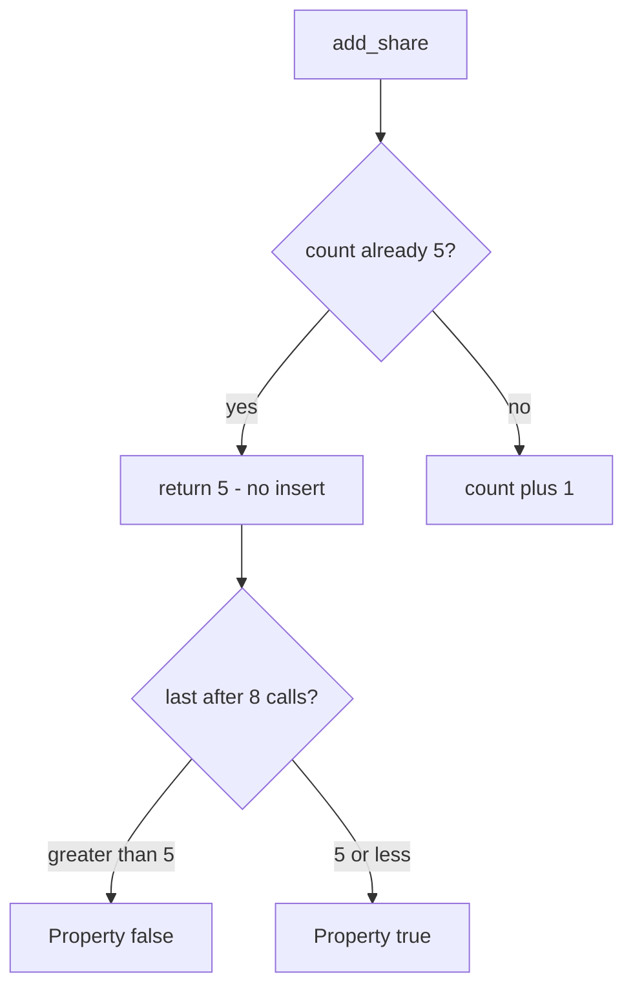

# 3.4-LO-04 — Check the count on the same write as the insert

**Kind:** design-exercise
**Loop step:** 4 Build
**Standards:** OWASP ASVS 5.0.0 (final) `v5.0.0-2.2.2`, `v5.0.0-2.3.2`, and `v5.0.0-2.3.4`. `v5.0.0-2.3.5` is **Level 3, advanced** (multi-user approval for overrides), not this pytest.

## Structural means the 6th insert cannot land

`add_share` must not increment when `_n >= 5`. Structural means the **server write path** compares count to cap — not HTML `max`, not a WAF, not “the owner will stop,” not a rate limit (6.7).

The smallest restore for SecureCollab Phase 1 share is: if count is already 5, return 5 and do not insert. Fail-safe: if the count store is uncertain, **deny** the 6th (2.4 fail-closed). Five honest shares still succeed.

## Mental model: deny at five, keep the count



The lab’s fixed tree uses `MAX = 5` and returns `_n` when the ceiling is hit. Production should check count in the **same transaction** as insert so two parallel sixths cannot both land (`v5.0.0-2.3.4` / 2.4). This lab’s oracle is sequential count under a loop, not a true race.

ASVS `v5.0.0-2.2.2` wants enforcement at a trusted service layer. The Next.js client may help usability; it must not be the control.

## Why this restores the cell

| After the fix | Must be true |
|---|---|
| Eight calls | `last <= 5` |
| Five calls | count is 5 (honest path) |
| Sixth call | does not increment |

## What this is not

HTML `max=5`. Cap on `/share` but not `/import` or GraphQL. Rate limit (6.7). Idempotency of the *same* member (2.4) — this cap is about *how many* grants, not replay of one grant. API4 as compliance.

## Mechanism limits

- Parallel sixths before commit (needs a lock — residual).
- Support override with no audit (`v5.0.0-2.3.5` advanced).
- Teams that honestly need more than five need an owned exception (E6), not a silent raise.
- A client that mints a new note to dodge the per-note cap is a different object.

## Practice

Name subject (scripted client), object (share grants on one note), predicate (count ≤ 5 after eight calls). Run:

```text
python3 -m pytest labs/3.4/3.4-lab/tests --impl fixed
```

Must pass.

## Transfer

Clinic: `add_guardian` stops at 3. Invite redemption stops at one use (6.6). Export quotas (6.7) cap bytes or rows — same shape, different 1.1 cell.

## Residual risk

Parallel sixths without a lock; support override; import/GraphQL paths; WCAG announcement that is not the cap.

## Usability

Announce “share limit reached” (WCAG 2.2 Success Criterion 4.1.3). Do not trade an accessible error for a client-only max.
