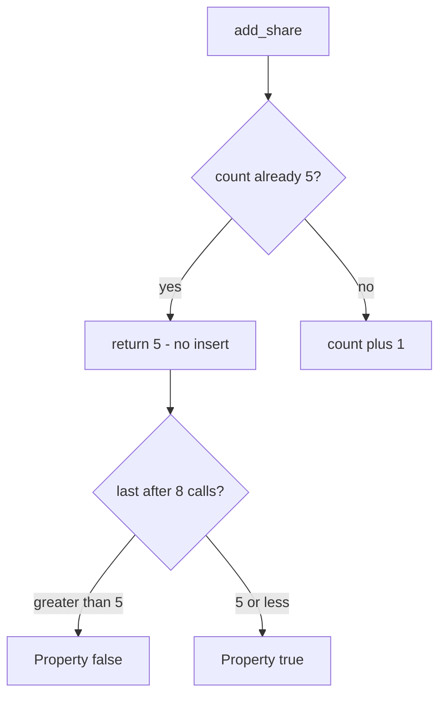

# 3.4-LO-04 — Check the count on the same write as the insert

**Kind:** design-exercise
**Loop step:** 4 Build
**Standards:** OWASP ASVS 5.0.0 (final) `v5.0.0-2.2.2`, `v5.0.0-2.3.2`, and `v5.0.0-2.3.4`.

## Structural means the 6th insert cannot land

`add_share` must not increment when `_n >= 5`. Structural means the **server write path** compares count to cap — not HTML `max`, not a WAF, not “the owner will stop.”

## Mental model: deny at five, keep the count



Fail-safe: if the count store is uncertain, **deny** the 6th (2.4 fail-closed). Five honest shares still succeed.

## Why this restores the cell

| After the fix | Must be true |
|---|---|
| Eight calls | `last <= 5` |
| Five calls | count is 5 (honest path) |
| Sixth call | does not increment |

## What this is not

HTML `max=5`. Cap on `/share` but not `/import`. Rate limit (6.7). Idempotency of the *same* member (2.4) — this cap is about *how many* grants, not replay of one grant.

## Practice

Name subject, object, and predicate. Run:

```
python3 -m pytest labs/3.4/3.4-lab/tests --impl fixed
```

Must pass.

## Transfer

Clinic: `add_guardian` stops at 3. Invite redemption stops at one use (6.6).

## Residual risk

Parallel sixths without a lock; support override; teams that honestly need more than five (E6).
