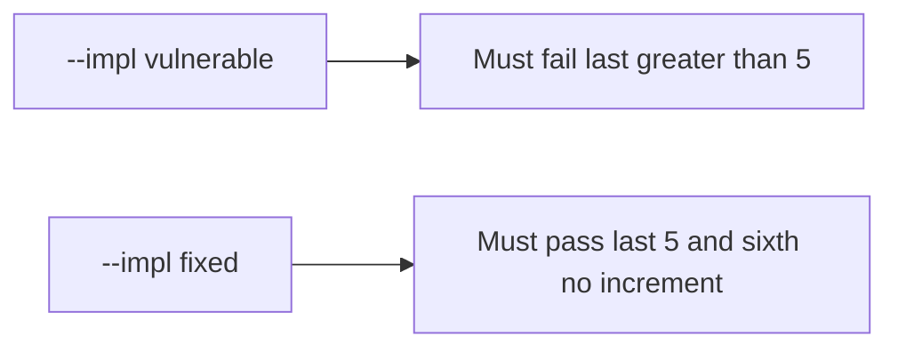

# 3.4-LO-05 — Evidence is last ≤ 5 after eight calls, then a passing pair

**Kind:** verification-lab
**Loop step:** 5 Verify
**Standards:** OWASP ASVS 5.0.0 (final) `v5.0.0-2.3.2`. API4/API6 are awareness, not this pair.

## An invariant that cannot fail a test is still a slogan

“We put max on the select” is not evidence. “WAF has API4” is a mechanism observation. The oracle is: after eight `add_share()` calls, `last <= 5`. That observation must be **false** on `--impl vulnerable` and **true** on `--impl fixed`.

## Mental model: vulnerable must fail: last greater than 5

The failing observation on `--impl vulnerable` is **last greater than 5**. A passing collection count is not this cell.



| Mode | Must show for this module |
|---|---|
| Normal | Five honest shares still land (`test_five_shares_are_allowed`) |
| Negative / abuse | Eight `add_share` calls leave `last <= 5`; vulnerable must fail |
| Sixth | Does not increment past 5 |
| Not claimed | Production locks; GraphQL; 6.7 rate limits; API4 compliance |

Lab tests in `labs/3.4/3.4-lab/tests/test_property.py`. `test_share_cap_is_enforced` is a **forbidden-outcome** test: a sixth grant is not allowed to count as a passing control.

```text
python3 -m pytest labs/3.4/3.4-lab/tests --impl vulnerable
python3 -m pytest labs/3.4/3.4-lab/tests --impl fixed
```

Map each test to an LO-02 cell. If vulnerable does not fail the eight-call assertion, the lab is miswired—fix the wiring, not the assertion.

## What the tests do not prove

- Two parallel sixths (needs a real lock — 2.4)
- Import/GraphQL paths
- Rate limits (6.7)
- Support override audit (`v5.0.0-2.3.5` advanced)
- That the WCAG status message exists (usability residual)

Record those as residuals or later modules, not as silent passes.

## Practice

Execute both implementations this session. Write the fail/pass pair next to the matrix row. Reject a “test” that only greps `max={5}` in JSX without calling `add_share` eight times.

## Transfer

Clinic guardians. A test that only asserts HTTP 200 is not cap evidence (see 9.3). A test that load-tests a live clinic is out of scope.

## Non-goals

Do not add a live flood. Do not log note bodies. Keys stay out of this file.
