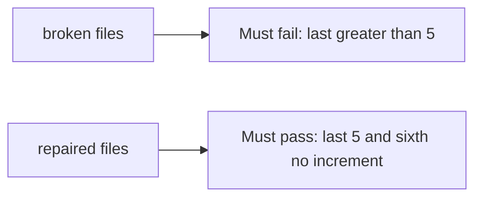

# A last page with more than five items must fail

**Kind:** verification-lab
**Loop step:** 5 Verify

## Check it

Putting max on a select is a form field, not the cap. An awareness-list rule on a filter is a label. After eight `add_share()` calls, `last` has to be `<= 5`. The leftover files: the eighth share still lands. Repair keeps `last` at five or fewer.

## Picture: last greater than 5 must fail

Asserting a max attribute exists can still hide that eight calls still leave count 8.



| Mode | Must show for this topic |
|---|---|
| Normal | Five honest shares still land (`test_five_shares_are_allowed`) |
| Wrong input / abuse | Eight `add_share` calls leave `last <= 5`; broken files must fail |
| Sixth | Does not increment past 5 |
| Not claimed | Production locks; GraphQL; rate limits; awareness-list compliance |

Open `labs/3.4/3.4-lab/tests/test_property.py`. Cap 5 is a lie if a sixth grant still lands.

```text
python3 -m pytest labs/3.4/3.4-lab/tests --impl vulnerable
python3 -m pytest labs/3.4/3.4-lab/tests --impl fixed
```

Map each test to the state-machine row you wrote. If the broken files do not fail the eight-call assertion, the lab is miswired — fix the wiring, not the check. A setup error is not proof the rule holds.

## What the tests do not prove

- Two parallel sixths (needs a real lock)
- Import/GraphQL paths
- Rate limits
- Support override audit (advanced)
- That the accessible status message exists (leftover)

## Practice

Call `add_share` eight times. A `max={5}` attribute in JSX is the form, not the cap.

## Use it somewhere new

HTTP 200 on add-share is not cap evidence. Do not run a test that load-tests a live clinic.

## What this page is not doing

Do not add a live flood. Do not log note bodies. Answer keys are not on this site.
