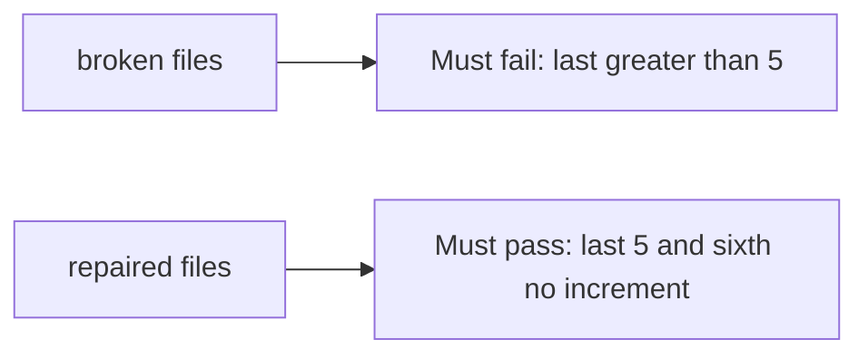

# A last page with more than five items must fail

**Kind:** verification-lab
**Loop step:** 5 Verify

## Check it

“We put max on the select” is not this topic’s evidence. “The filter has an awareness-list rule” is a tool observation. The check is: after eight `add_share()` calls, `last <= 5`. That observation must be **false** on the broken files and **true** on the repaired files.

## Picture: last greater than 5 must fail

A check that only asserts a max attribute exists can still look green while eight calls still leave count 8.



| Mode | Must show for this topic |
|---|---|
| Normal | Five honest shares still land (`test_five_shares_are_allowed`) |
| Wrong input / abuse | Eight `add_share` calls leave `last <= 5`; broken files must fail |
| Sixth | Does not increment past 5 |
| Not claimed | Production locks; GraphQL; rate limits; awareness-list compliance |

The checks live in `labs/3.4/3.4-lab/tests/test_property.py`. `test_share_cap_is_enforced` is there so a sixth grant cannot sneak through.

```text
python3 -m pytest labs/3.4/3.4-lab/tests --impl vulnerable
python3 -m pytest labs/3.4/3.4-lab/tests --impl fixed
```

Map each test to the state-machine row you wrote. If the broken files do not fail the eight-call assertion, the lab is miswired — fix the wiring, not the check. A setup error is not proof the rule holds.

## What the tests do not prove

- Two parallel sixths (needs a real lock)
- Import/GraphQL paths
- Rate limits
- Support override audit (advanced)
- That the accessible status message exists (leftover)

## Practice

Write fail or pass next to the matrix row. Reject a “test” that only greps `max={5}` in JSX without calling `add_share` eight times.

## Use it somewhere new

Clinic guardians. A test that only asserts HTTP 200 is not cap evidence. A test that load-tests a live clinic is out of scope.

## What this page is not doing

Do not add a live flood. Do not log note bodies. Answer keys are not on this site.
