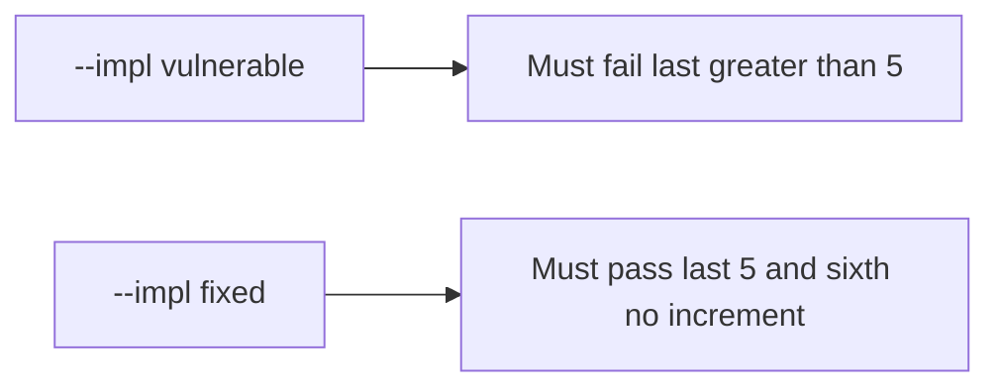

# 3.4-LO-05 — Evidence is last ≤ 5 after eight calls, then a passing pair

**Kind:** verification-lab
**Loop step:** 5 Verify
**Standards:** OWASP ASVS 5.0.0 (final) `v5.0.0-2.3.2`.

## An invariant that cannot fail a test is still a slogan

“We put max on the select” is not evidence. The oracle is the local pair.

## Mental model: fail-on-vulnerable, pass-on-fixed



| Case | Must show |
|---|---|
| Negative / abuse | Eight `add_share` calls leave `last <= 5` |
| Normal | Five honest shares still land |
| Sixth | Does not increment past 5 |
| Not claimed | Production locks; GraphQL; 6.7 |

Lab tests in `labs/3.4/3.4-lab/tests/test_property.py`:

```
python3 -m pytest labs/3.4/3.4-lab/tests --impl vulnerable
python3 -m pytest labs/3.4/3.4-lab/tests --impl fixed
```

## What the tests do not prove

- Two parallel sixths (needs a real lock — 2.4)
- Import/GraphQL paths
- Rate limits (6.7)

## Practice

Execute both implementations. Map each test to an LO-02 cell.

## Transfer

Clinic guardians. A test that only asserts HTTP 200 is not cap evidence (see 9.3).
