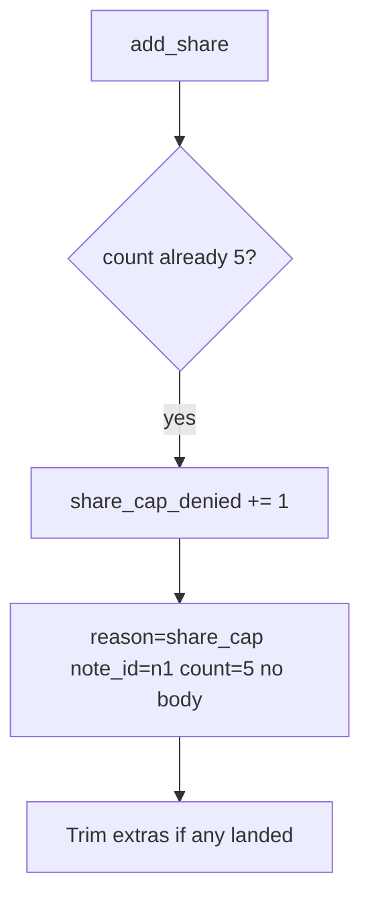

# Notice the 6th deny; trim extras without logging bodies

**Kind:** operations-exercise
**Loop step:** 6 Operate

## Fixing it once is not enough

An import job, a support tool, or a missed GraphQL mutation can still insert a sixth after `/share` was “capped once.” Do not log note bodies. Do not paste member emails into the ticket.

## Picture: metric on deny, then trim



| Outcome | This topic |
|---|---|
| Notice | `share_cap_denied`; anomaly on one note |
| What the line holds | note id, count, reason; never the body |
| Recover | Trim extra grants; tell the owner |
| Leftover | Teams >5 need an owned exception |

Announce “share limit reached” so people can hear it. That announcement is not the cap, and a vendor name does not prove the write-path cap.

## What the framework does vs what you still have to check

A filter will page on request rate and stay silent when five slow grants plus a sixth import land. Notice must observe **share_count versus cap**, not requests per minute. If the alert includes a note body, you have opened a leak.

## Practice

Write one log line you would accept. Tie it to `labs/3.4/3.4-lab`.

```text
log_denied reason=share_cap note_id=n1 count=5 request_id=req_34bl
```

Reject any line that includes a note body, a real email, “awareness list handled,” or a filter product name as the rule.

## Use it somewhere new

A clinic example: notice a 4th guardian; do not paste the child’s name into the ticket. Invite tokens: notice a second redeem without logging the token.

## Can people still use it

The owner-visible error must be something assistive tech can announce, not only a red border. Keyboard users still need a path that does not mint extra grants.

## What this page is not doing

Live load tests are out of scope. Answer keys are not on this site.
