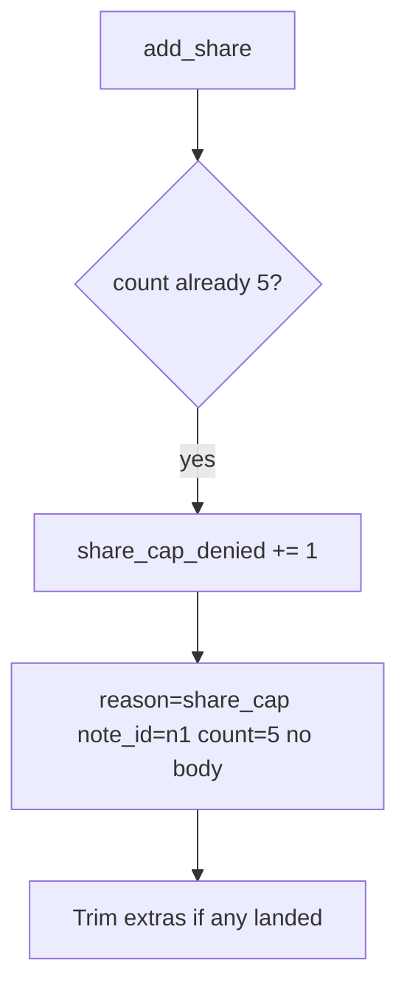

# 3.4-LO-06 — Detect the 6th deny; trim extras without logging bodies

**Kind:** operations-exercise
**Loop step:** 6 Operate
**Standards:** NIST CSF 2.0 (final) DE/RS/RC as outcome labels; OWASP ASVS 5.0.0 (final) `v5.0.0-2.3.2`. WCAG 2.2 (final) 4.1.3 for the owner-visible error.

## Prevention is not absolute

An import job, a support tool, or a missed GraphQL mutation can still insert a sixth. Pair detect and recover. Do not log note bodies (3.1).

## Mental model: metric on deny, then trim



| Outcome | This module |
|---|---|
| Detect | `share_cap_denied`; anomaly on one note |
| Signal | note id, count, reason; never the body |
| Recover | Trim extra grants; notify owner |
| Residual | Teams >5 need an owned exception (E6) |

Announce “share limit reached” to assistive tech (WCAG 4.1.3). That announcement is not the cap.

## Practice

Write one log line you would accept. Tie it to `labs/3.4/3.4-lab`.

```
log_denied reason=share_cap note_id=n1 count=5 request_id=req_34bl
```

Reject any line that includes a note body or a real email.

## Transfer

Clinic: detect 4th guardian; do not paste the child’s name into the ticket.

## Non-goals

SIEM product names are not the property.
