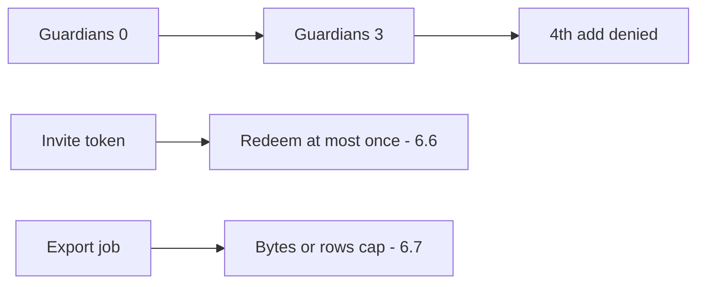

# 3.4-LO-07 — Transfer: clinic guardians, invites, and export quotas

**Kind:** transfer-challenge
**Loop step:** 7 Transfer
**Standards:** OWASP ASVS 5.0.0 (final) `v5.0.0-2.3.2`; API Top 10:2023 API4/API6 **awareness** only.

## Change the object; keep the write-path cap

Do not answer with a Top 10 / CWE / scanner as the definition of security.

**Prompt:** Clinic: max 3 guardians per child. Optionally map invite tokens (6.6) and export quotas (6.7) as *different objects, same shape*.

**Product sketch:** EHR-lite guardian list on a booking card.

Rewrite the SecureCollab sentence. Include:

1. attacker capabilities (scripted add; disabled UI max; import — not a live clinic);
2. trust assumptions (which write path is TCB; HTML is not);
3. forbidden outcome (`add_guardian` four times yields count 4, not “HIPAA”);
4. a test idea on a **local** fixture only;
5. residual (honest family of 4 needs an owned exception; parallel adds need a lock);
6. WCAG 2.2 4.1.3 if the denial is shown to a human (announce “guardian limit reached”).

## Mental model: three is not five, the shape is the same

API4/API6 may appear in a regression checklist after the machine exists. They are not the property.

## What graders reject

| Reject | Why |
|---|---|
| CWE-799 as the property | Weakness name ≠ cap |
| Rate limit as the cap | Different 1.1 cell |
| Live clinic APIs | Lab policy |
| HTML max=3 as enforcement | Client is untrusted |

## Practice

One page. No keys. `labs/3.4/3.4-lab` is the only running system you may break.
