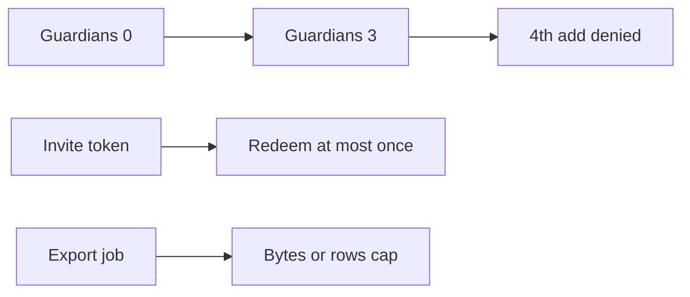

# Same idea on clinic guardians, invites, and export quotas

**Kind:** transfer-challenge
**Loop step:** 7 Transfer

## Use it somewhere new

You get a **clinic guardian list**, an **invite token**, or an **export quota**. Eight `add_share` calls leave count ≤ 5.

Clinic: max 3 guardians per child. Optionally map invite tokens and export quotas as *different objects, same shape*.

EHR-lite guardian list on a booking card.

1. who might try (scripted add; disabled UI max; import — **not** a live clinic);
2. what you trust (which write path is trusted; HTML is not);
3. what must not happen (`add_guardian` four times yields count 4 — not a privacy-law name and not an awareness-list name);
4. a check on a **local** practice only (loop four times, last ≤ 3);
5. leftover (honest family of 4 needs an owned exception; parallel adds need a lock);
6. whether a human path must meet the web accessibility baseline (announce “guardian limit reached” if the denial is shown to a human).

## Picture: three is not five, the shape is the same

A guardian invite is a share grant. A fourth guardian and a second invite redeem are new rules. HTML max does not stop the fourth grant.

Awareness-list names may appear in a regression checklist after the machine exists. They are not the rule. Rate limit is availability; this cap is integrity of the share / guardian graph. Idempotency of one grant is a different earlier topic.

## What is not good enough

| Reject | Why |
|---|---|
| A weakness nickname as the rule | Weakness name ≠ cap |
| Rate limit as the cap | A different rule |
| Live clinic APIs | Course rules |
| HTML max=3 as enforcement | Client is untrusted |
| Awareness-list sticker | Awareness only |

## Practice

Write one page. Leave the keys closed. `labs/3.4/3.4-lab` is the only running system you may break. Do not load-test a clinic or an invite API.

## What this page is not doing

Do not try live-target bots. Do not use real member emails. This page does not finish a check-in.
