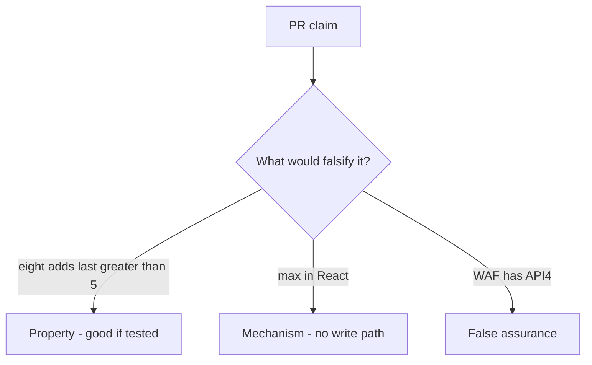

# 3.4-LO-08 — Review the uncapped counter as a PR, not a WAF ticket

**Kind:** code-review
**Loop step:** Review
**Standards:** OWASP ASVS 5.0.0 (final) `v5.0.0-2.2.2` and `v5.0.0-2.3.2`. API4 is awareness, not the finding title.

## Review the fixture as if it were SecureCollab’s share write path

Review `labs/3.4/3.4-lab/vulnerable/` as a SecureCollab PR. Your job is not to count suspicious lines. Reconstruct whether eight `add_share` calls still leave `last > 5`, compare that with the module invariant, and write changes a developer can verify.

Intended findings live only in `content/assessment/keys/3.4.md` — not here. Do not open the keys file until your review has been evaluated.

## Mental model: Cap in React only

Start with this seeded smell: **Cap in React only**. Label it property, mechanism, or false assurance before you accept the PR.

Classification starts at the protected effect (count ≤ 5 after eight writes). Everything that is not a write-path ceiling at that loop is a candidate ambient path.

## Seeded smells (label them yourself)

- Cap in React only
- No transaction around count+insert
- Test loops 8 times and expects success
- Support tool bypasses cap without audit

Also reject: client trust; closing findings without re-running `test_share_cap_is_enforced`; keys in lessons; real PII in fixtures; CWE-799 as the requirement; live load tests.

## Misconceptions this module refuses

- Business logic is not security
- Rate limits replace product caps
- CWE-799 is the requirement
- FastAPI or SQLAlchemy will stop at five
- WCAG announcement is the cap

## Practice

Write three review notes a maintainer could act on. Each note: observation, property or false assurance, suggested structural change, residual you will **not** delete. Tie at least one to `test_share_cap_is_enforced`.

## Transfer

Clinic PR that “adds max=3 on the select” without a write-path test is an incomplete mediation review. Name the independent falsehood that would still keep the fourth guardian out.

## HITL / WCAG 2.2

Error “share limit reached” must be programmatically announced (WCAG 4.1.3), not only a red border. Announcing it does not enforce the cap.

## Non-goals

Do not merge by adding a comment “will cap later.” That comment is a residual without an owner. Do not flood a public API to prove the finding.
