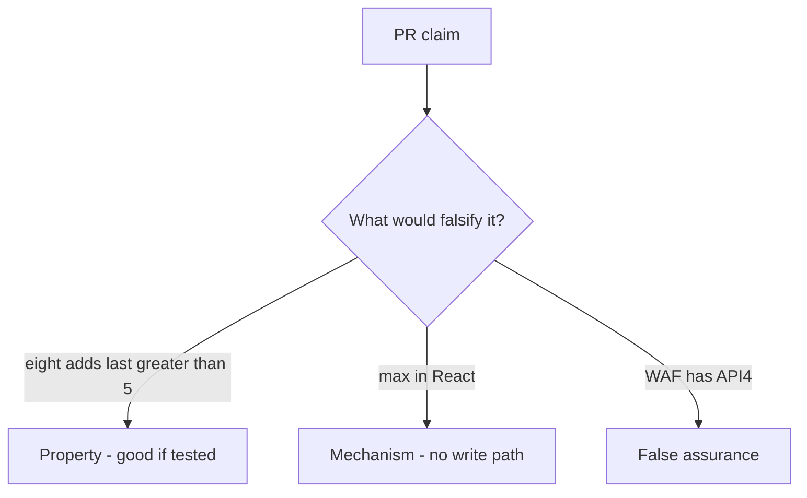

# 3.4-LO-08 — Review the uncapped counter as a PR, not a WAF ticket

**Kind:** code-review
**Loop step:** Review
**Standards:** OWASP ASVS 5.0.0 (final) `v5.0.0-2.2.2` and `v5.0.0-2.3.2`.

## Review the fixture as if it were SecureCollab’s share write path

Review `labs/3.4/3.4-lab/vulnerable/` as a SecureCollab PR. Intended findings live only in `content/assessment/keys/3.4.md` — not here.

## Mental model: property, mechanism, or false assurance

Seeded smells (label them yourself; do not open the keys file):

- Cap in React only
- No transaction around count+insert
- Test loops 8 times and expects success
- Support tool bypasses cap without audit

Also reject: client trust, closing findings without retest, keys in lessons, real PII in fixtures, CWE-799 as the requirement.

## Misconceptions

- Business logic is not security
- Rate limits replace product caps
- CWE-799 is the requirement

## Practice

Write three review notes. Tie at least one to `test_share_cap_is_enforced`.

## Transfer

Clinic PR that “adds max=3 on the select” without a write-path test is incomplete.

## HITL / WCAG 2.2

Error “share limit reached” must be programmatically announced (WCAG 4.1.3), not only a red border. Announcing it does not enforce the cap.
