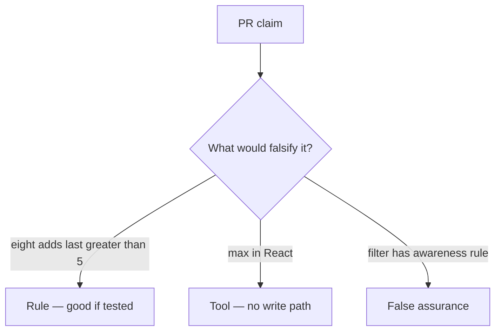

# Review of uncapped add_share

**Kind:** code-review
**Loop step:** Review

## What you are reviewing

Review `labs/3.4/3.4-lab/vulnerable/` as a change to notes-app share. Check whether eight `add_share` calls still leave `last > 5`.

You already ran `test_share_cap_is_enforced` — that is the rule. A comment “will cap later” is not.

## Picture: cap in React only

**Cap in React only**.

The count still has to be ≤ 5 after eight writes. If the loop never checks a write-path ceiling, that leftover path is still open.

## Problems to find (name them yourself)

- Cap in React only
- No transaction around count+insert
- Test loops 8 times and expects success
- Support tool bypasses cap without audit

Also reject: treating the client as what you trust; closing findings without re-running `test_share_cap_is_enforced`; keys in learner notes; real personal data in practice files; a weakness nickname as the requirement; live load tests.

## Common mix-ups

- Business logic is not security
- Rate limits replace product caps
- A weakness nickname is the requirement
- FastAPI or SQLAlchemy will stop at five
- An accessible announcement is the cap

## Practice

Write the review that would block this change. Name `test_share_cap_is_enforced`.

## Use it somewhere new

Clinic change that “adds max=3 on the select” without a write-path test is an incomplete review. Name the independent falsehood that would still keep the fourth guardian out.

## Can people still use it

Error “share limit reached” must be something assistive tech can announce, not only a red border. Announcing it does not enforce the cap.

## What this page is not doing

Do not merge by adding a comment “will cap later.” That comment is leftover risk without an owner. Do not flood a public API to prove the finding.
