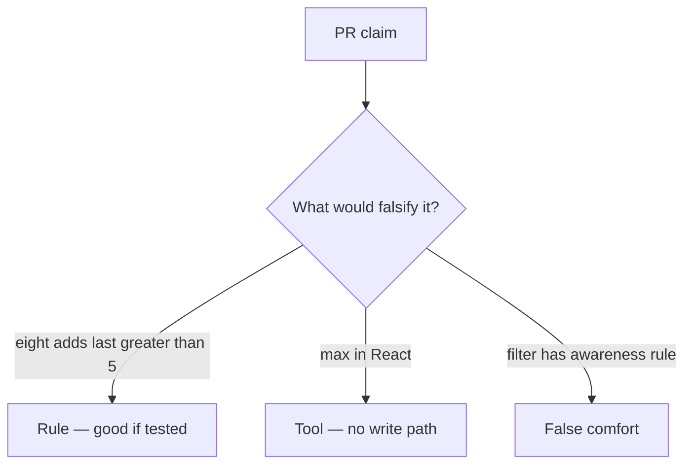

# Review of uncapped add_share

**Kind:** code-review
**Loop step:** Review

Intended findings live only in the answer-key folder — not here. Do not open that file until your review has been evaluated.

## What you are reviewing

A colleague ships notes-app share. Review `labs/3.4/3.4-lab/vulnerable/` as that change. Your job is not to count suspicious lines. Reconstruct whether eight `add_share` calls still leave `last > 5`, compare that with the rule, and write changes a developer can verify.

The check you already ran (`test_share_cap_is_enforced`) is the rule test. A comment “will cap later” is not.

## Picture: cap in React only

Start with this seeded smell: **Cap in React only**. Label it rule, tool, or false comfort before you accept the change.

Hold onto count ≤ 5 after eight writes. If that loop is missing a write-path ceiling, you still have a leftover path.

## Problems to find (name them yourself)

- Cap in React only
- No transaction around count+insert
- Test loops 8 times and expects success
- Support tool bypasses cap without audit

Also reject: treating the client as what you trust; closing findings without re-running `test_share_cap_is_enforced`; keys in learner notes; real personal data in practice files; a weakness nickname as the requirement; live load tests.

## Common mix-ups

- Business logic is not security
- Rate limits replace product caps
- A weakness nickname is the requirement
- FastAPI or SQLAlchemy will stop at five
- An accessible announcement is the cap

## Practice

Write three review notes a maintainer could act on. Each note: what you saw, rule or false comfort, suggested structural change, leftover you will **not** delete. Tie at least one to `test_share_cap_is_enforced`. Do not open the keys file.

## Use it somewhere new

Clinic change that “adds max=3 on the select” without a write-path test is an incomplete review. Name the independent falsehood that would still keep the fourth guardian out.

## Can people still use it

Error “share limit reached” must be something assistive tech can announce, not only a red border. Announcing it does not enforce the cap.

## What this page is not doing

Do not merge by adding a comment “will cap later.” That comment is leftover risk without an owner. Do not flood a public API to prove the finding.
