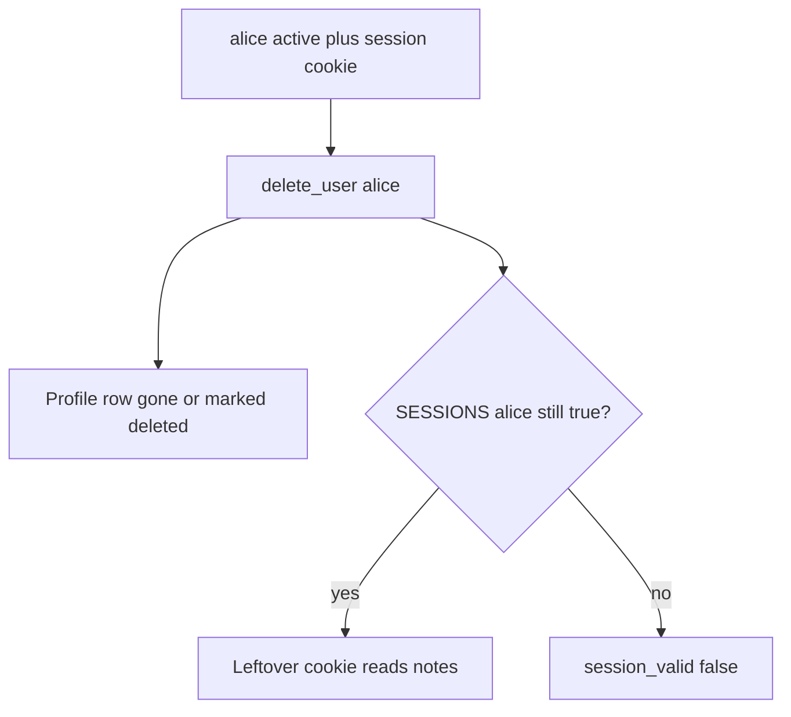
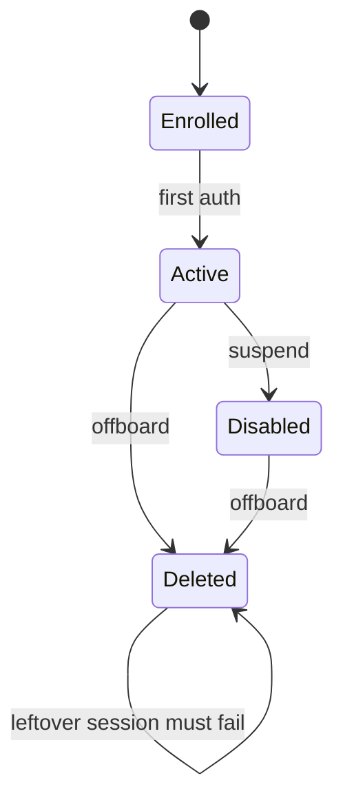

# Delete must kill the session, not only the profile row

**Kind:** concept-model
**Loop step:** 1 Property

## The rule

The notes app has people with account states. Deleting `alice` is a change over **time**. After that, she must no longer read notes.

A leftover session cookie is still her. A leftover refresh token is still her. A worker still holding `user_id` is still her. An “account deleted” email does not kill any of that.

> After `delete_user("alice")`, `session_valid("alice")` must be false. Lifecycle is every leftover that can still act as that person, not a login screen. Single sign-on, the web session library, and “we disabled the password” do not by themselves kill the cookie.

So what must not happen: **a deleted user’s leftover session still works**. `delete_user` marks the profile deleted, but `SESSIONS["alice"]` stays true. The notes are still readable after the person is gone.

All active sessions have to be killed when an account is disabled or deleted. They also want further use of that session refused — kill the server-side state. Self-contained tokens need a denylist or a per-user not-before. Revoking a stolen login factor is advanced work, not this week's check. Identity guidance separates identifiers, authenticators, and session. This week's check is session-after-delete, not proofing who someone is.

## Picture: the leftover outlives the person



The person who can still get in is an ex-employee with a copied cookie, or a delayed worker still holding `user_id`. Trusting HR email or “login is disabled” is not what you trust.

**The tool (not the rule):** SessionMiddleware, a single-sign-on logout product, or `DELETE FROM users`.

## Picture: states, not a login screen



Disabled and deleted are different product states. Both must fail `session_valid` in this week's freeze. Recovery and signing up again come later. They must not bring the old cookie back to life.

## Why it happens, what it costs, how you stop it, how you notice, how you recover

Someone killed the profile row and left the session. That is the cause. The person who later presents the cookie is a **result**, not the cause.

| Slice | For this rule |
|---|---|
| Why it happens | The authentication leftover outlived the person |
| What has to be true first | `delete_user` removes the profile only |
| Trigger | Cookie presented after they leave |
| What it costs | The notes are still readable; secrecy over time |
| How you stop it | Kill sessions (and tokens, workers) in the same delete |
| How you notice | Use of a session after `user_state=deleted` |
| How you recover | Mass revoke; rotate signing keys if tokens self-verify |

## What the framework does vs what you still have to check

SessionMiddleware does not know HR offboarding. A token with `exp` in 30 days still verifies unless you check a per-user not-before. The app's promise: after `delete_user("alice")`, `session_valid("alice")` is False. The local check is `labs/4.1/4.1-lab`. Fake data only. No live identity provider.

## What the tool cannot do

- Email “you’re deleted” is not killing the session.
- Refresh tokens; a phone's offline cache (later); a shared device.
- Backups still contain the user row (later).

## Practice

Name the state change and the leftover. Then run:

```text
python3 -m pytest labs/4.1/4.1-lab/tests --impl vulnerable
python3 -m pytest labs/4.1/4.1-lab/tests --impl fixed
```

The first command must fail. The second must pass. Tie the check to `session_valid` after delete, not to a single-sign-on product name.

## Use it somewhere new

A clinic example: a clinician leaves. The badge is disabled. The chart cookie must die the same day.

## What this page is not doing

Live identity providers, real HR exports, real session cookies from production, weaponized token replay. Answer keys are not on this site.
