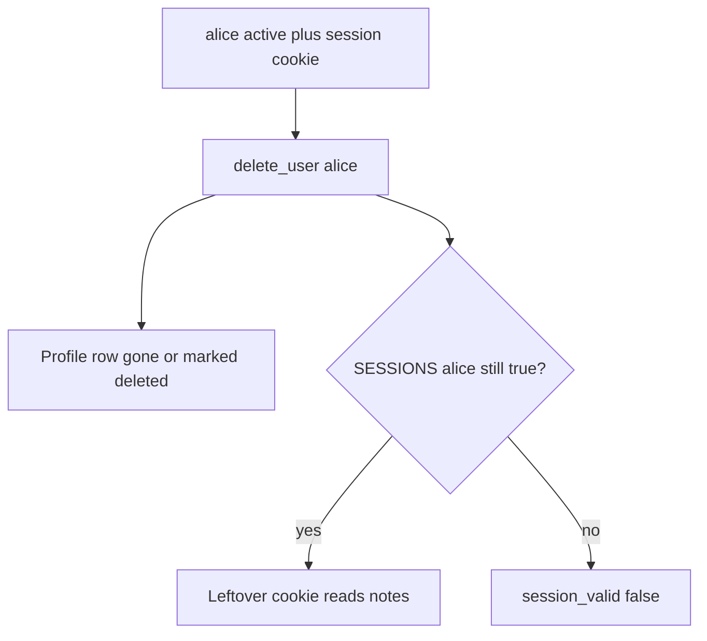
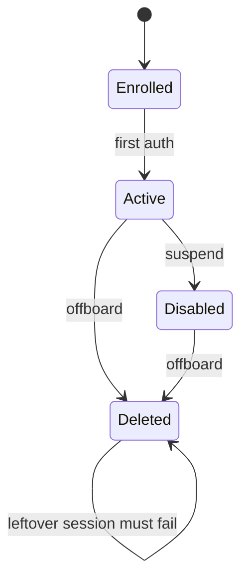

# 4.1-LO-01 — Delete must kill the session, not only the profile row

**Kind:** concept-model
**Loop step:** 1 Property
**Standards:** NIST SP 800-63-4 (final) account lifecycle; OWASP ASVS 5.0.0 (final) `v5.0.0-7.4.2` and `v5.0.0-7.4.1`; `v5.0.0-6.5.6` is **Level 3, advanced** (revoke an authentication factor on theft). Starlette SessionMiddleware is not this sentence.

## The claim this module owns

SecureCollab Phase 1 subjects have account states. Deleting `alice` is a 1.2 change over **time**: that principal must no longer read notes. A leftover session cookie, a refresh token, or a worker still holding `user_id` is an authentication artifact that outlived the subject. An “account deleted” email is not revocation.

> After `delete_user("alice")`, `session_valid("alice")` must be false. Lifecycle is complete mediation across account states, not a login screen. SSO, SessionMiddleware, and “we disabled the password” do not by themselves kill the cookie.

The forbidden outcome is **deleted user’s leftover session still authenticates**: `delete_user` adds the profile to `DELETED` but `SESSIONS["alice"]` stays true. That is a 1.1 confidentiality failure with a 1.2 cell that time reopened.

ASVS `v5.0.0-7.4.2` wants all active sessions terminated when an account is disabled or deleted. `v5.0.0-7.4.1` wants further use of that session disallowed (invalidate backend state; self-contained tokens need a denylist or per-user not-before). `v5.0.0-6.5.6` is **Level 3 (advanced)** factor revocation — not a silent baseline. NIST SP 800-63-4 separates identifiers, authenticators, and session; this lab’s oracle is session-after-delete, not proofing.

## Mental model: the artifact outlives the subject



The attacker is an ex-employee with a copied cookie, or a delayed worker (7.4) using the old `user_id`. Trusting HR email or “login is disabled” is not a TCB.

**Mechanism (not the property):** Starlette SessionMiddleware, Auth0 SLO, or `DELETE FROM users`.

## Mental model: states, not a login screen



Disabled and deleted are different product states. Both must fail `session_valid` in this lab’s freeze. Recovery and re-enrollment are later 4.2; they must not resurrect the old cookie.

## Root cause vs impact vs prevention vs detection vs recovery

| Slice | For this property |
|---|---|
| Root cause | Authentication artifact outlived the subject |
| Preconditions | `delete_user` removes profile only |
| Trigger | Cookie presented after offboarding |
| Impact | Confidentiality of tenant notes; 1.2 over time |
| Prevention | Invalidate sessions (and tokens, workers) in the same use-case |
| Detection | Use of session after `user_state=deleted` |
| Recovery | Mass revoke; rotate signing keys if tokens self-verify |

## Framework defaults versus the lifecycle guarantee

SessionMiddleware does not know HR offboarding. A JWT with `exp` in 30 days still verifies unless you check a per-user not-before. The lab guarantee: after `delete_user("alice")`, `session_valid("alice") is False`. Oracle: `labs/4.1/4.1-lab`. No live IdP.

## Mechanism limits

- Email “you’re deleted” is not revocation.
- Refresh tokens; mobile offline cache (8.2); shared device.
- Backups still contain the user row (5.1).

## Practice

Name the state change and the leftover artifact. Then run:

```
python3 -m pytest labs/4.1/4.1-lab/tests --impl vulnerable
python3 -m pytest labs/4.1/4.1-lab/tests --impl fixed
```

The first command must fail. The second must pass. Map the assertion to `session_valid` after delete, not to an SSO product name.

## Transfer

Clinic: departing clinician. The badge is disabled; the EHR cookie must die the same day.

## Non-goals

Live IdPs, real HR exports, real session cookies from production, weaponized token replay. Gates 0–10 and milestones M0–M5 stay **not-attempted** without learner or product evidence. Answer keys are not in this file.
