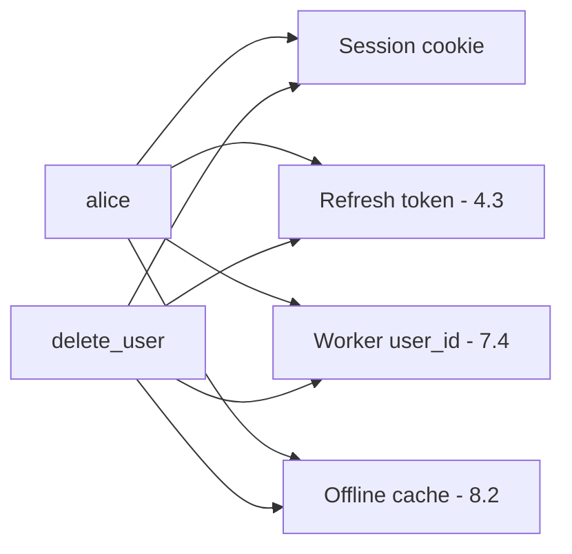
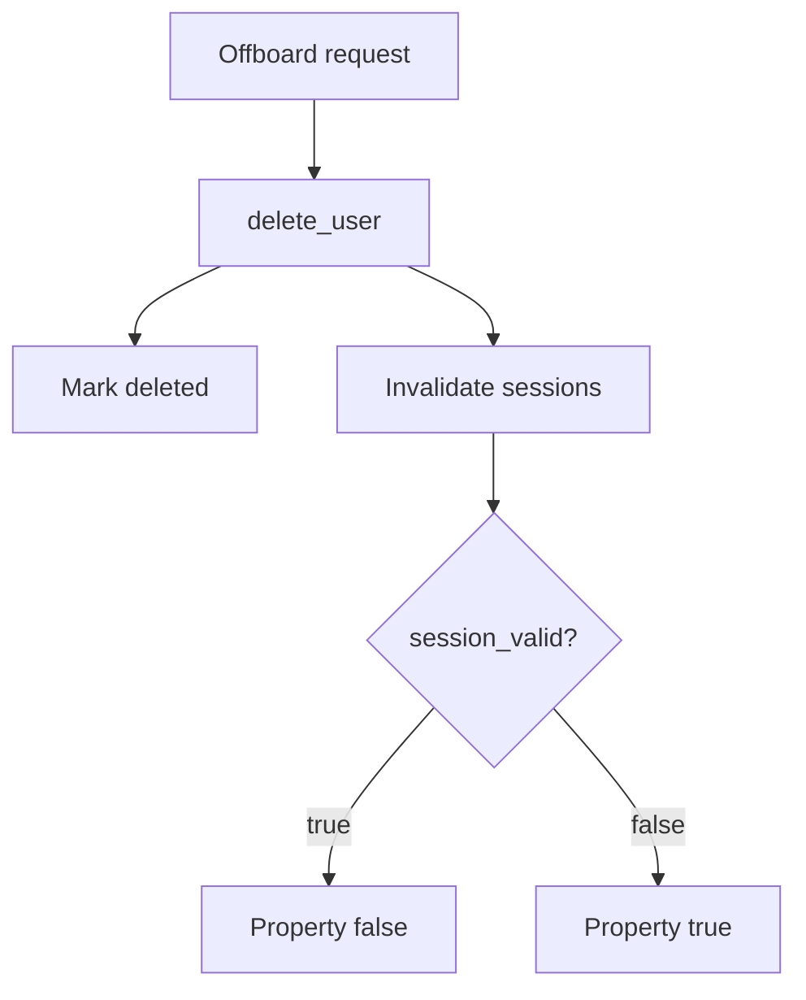

# 4.1-LO-02 — A lifecycle a second engineer can test

**Kind:** design-exercise
**Loop step:** 2 Model
**Standards:** NIST SP 800-63-4 (final); OWASP ASVS 5.0.0 (final) `v5.0.0-7.4.2`.

## Can a second engineer name pytest cases from your state machine?

“We delete the user” is not this lesson. A reviewable model names **account states**, **artifacts that must die**, and **who may offboard**.

SecureCollab Phase 1 freeze: local `SESSIONS` / `DELETED` maps; user `alice`. No live SSO.

## Mental model: every artifact is a row in the matrix

If any arrow is missing, leftover access appears. This lab only executes the session arrow.

## Mental model: delete is a use-case, not a SQL statement

## Step 1: freeze pieces

| Piece | This system |
|---|---|
| Subjects | alice; offboarding admin; stolen-cookie attacker |
| Objects | profile; session; notes |
| Actions | `delete_user`; `session_valid` |
| Channels | Cookie jar; later worker queue |
| TCB | Delete use-case that kills sessions |
| Untrusted | “Login disabled”; SLO email |
| State / time | Cookie presented after delete |
| 1.1 cell | Confidentiality over time |

## Step 2: write cells

| Subject | Object | Action | Decision |
|---|---|---|---|
| alice (active) | notes | read with session | allow |
| alice (deleted) | notes | read with leftover session | deny |
| admin | alice | delete | allow (audited) |
| worker | alice user_id | execute after delete | deny (named 7.4 hole) |

## Practice

Draw this map so a second engineer could name pytest cases. Point at `labs/4.1/4.1-lab` file `lifecycle.py`.

## Transfer

Clinic departing clinician. Shared workstation cookie.

## Residual risk

Backups (5.1); mobile cache (8.2); self-contained JWT until key rotation.

## Non-goals

Top 10 as the definition of security. Keys stay out of lessons.
