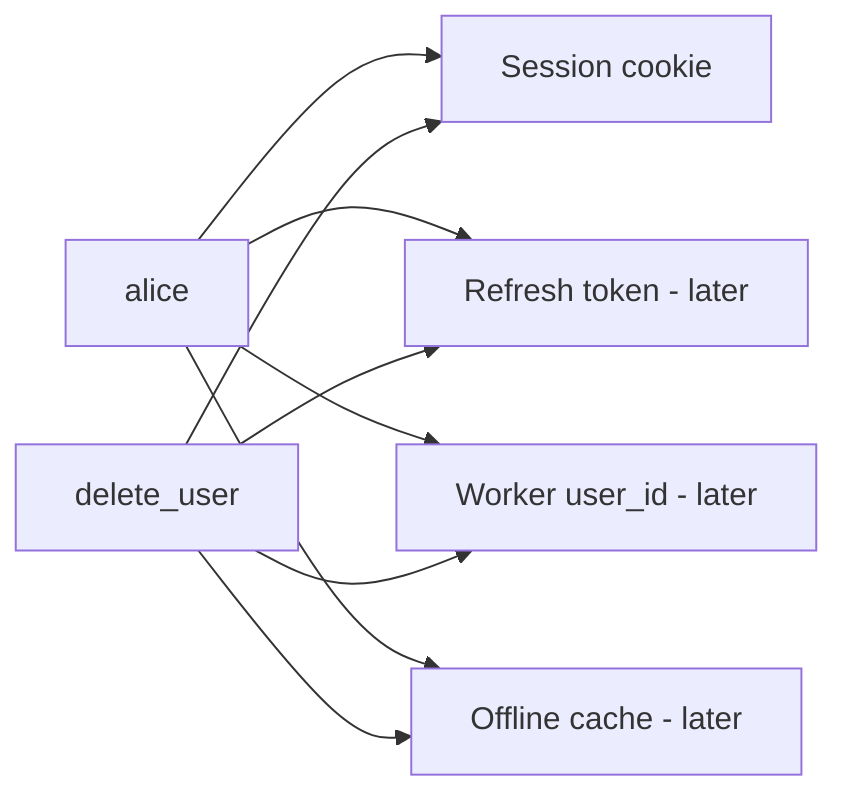
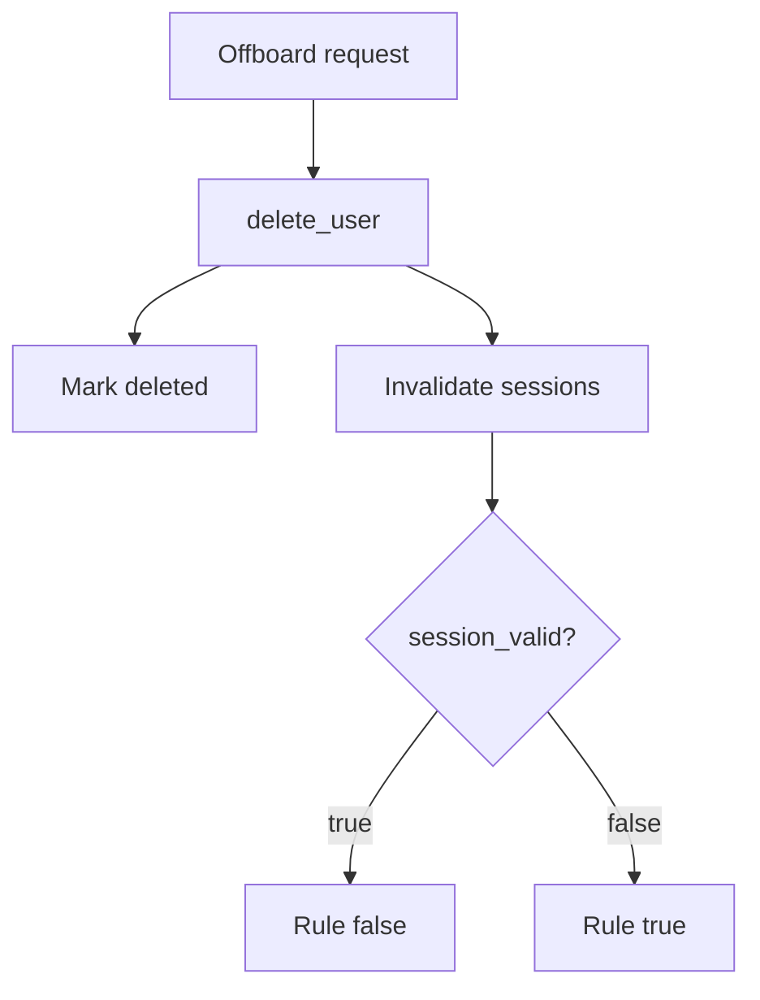

# A lifecycle someone else can test

**Kind:** design-exercise
**Loop step:** 2 Model

## Could someone else name the checks?

“We delete the user” is not this lesson. A map someone else can test names **account states**, **leftovers that must die**, and **who may offboard**.

`SESSIONS` / `DELETED` maps; user `alice` — no live single sign-on.

> After `delete_user("alice")`, `session_valid("alice")` must be false. If a leftover is missing from the map, leftover access appears.

## Picture: every leftover is a row

If any arrow is missing, leftover access appears. The check only runs the session arrow.

## Picture: delete is a path, not a SQL statement

Killing the profile row is one step. Killing the session is another. They belong in the **same** delete.

## Step 1: name the pieces

| Piece | This system |
|---|---|
| Who | alice; offboarding admin; stolen-cookie attacker |
| What | profile; session; notes |
| Actions | `delete_user`; `session_valid` |
| Paths | Cookie jar; later a worker queue |
| What you trust | The delete path that kills sessions |
| What you do not trust | “Login disabled”; a logout email |
| Time | Cookie presented after delete |
| The rule | Notes stay secret after the person is gone |

## Step 2: write allow and deny

| Who | What | Action | Decision |
|---|---|---|---|
| alice (active) | notes | read with session | allow |
| alice (deleted) | notes | read with leftover session | deny |
| admin | alice | delete | allow (audited) |
| worker | alice user_id | execute after delete | deny (named later hole) |

A missing “deleted alice × leftover session × deny” row is how the cookie still reads notes. Write the hole.

## Practice

In `labs/4.1/4.1-lab`, mark `lifecycle.py`. Write down state, leftover, allow or deny, and what would show the deny is false. Fake data only.

## Use it somewhere new

A clinic example: a clinician leaves. Shared workstation cookie. Disabling the badge does not name the chart session.

## What can still go wrong

Backups still contain the user row. A phone's offline cache. A self-contained token until you rotate keys or set a per-user not-before.

## What this page is not doing

Do not run this map against a public clinic or a live identity provider. Answer keys are not on this site.
