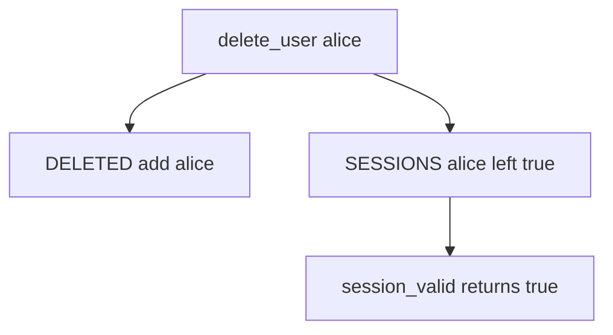

# Practice: a deleted user’s leftover session still works

**Kind:** mechanism-lab
**Loop step:** 3 Break

## Try it

The practice is not a website you attack. It is a tiny Python `delete_user` and `session_valid`. The failure is already in the functions: delete marks the profile and leaves the session. That leftover is a **failed rule**, not a cleanup nit.

The rule under test:

> After `delete_user("alice")`, `session_valid("alice")` must be false. If it is still true, a leftover session still works.

## Where you may practice

Only `labs/4.1/4.1-lab` is in scope. The maps are in-process: `SESSIONS` and `DELETED`. The user is the synthetic name `alice`. It does not open an identity provider, a logout product, or a browser cookie jar.

Do not replay a production cookie. Do not replay an employer single-sign-on session. Do not replay a classmate login. Do not steal a cookie “to see what happens.”

What is supposed to stop this: `delete_user` is supposed to kill leftovers in the same delete. HR email, “password disabled,” and a single-sign-on brand name are not enough.

Who can still get in, in this story: an ex-employee, or a copied cookie on a shared workstation, who can present `SESSIONS["alice"]` after offboarding. That stands in for a delayed worker still holding `user_id`.

## Picture: profile marked, cookie still live



The broken files take that path on purpose. You do not need a real cookie string. The leftover still returning true *is* the leak.

All active sessions have to be killed when an account is disabled or deleted. `DELETE FROM users` is a profile observation, not that kill.

## What to look at — cause, not a dump

Read `vulnerable/lifecycle.py`. `delete_user` only adds the user to `DELETED`. `session_valid` still returns `SESSIONS.get(user)`. Tests:

- `test_active_session_is_valid` — honest path before delete
- `test_deleted_user_session_is_dead` — `session_valid` false after delete
- `test_deleted_denies_even_if_session_map_still_has_row` — resurrected map entry still denied on the repaired files

You do not need a new username. The failure of `test_deleted_user_session_is_dead` *is* the evidence.

| What you see | What kind of failure | Not the lesson |
|---|---|---|
| Profile in `DELETED`, session still true | Leftover outlived the person | “The row is gone” |
| `session_valid` returns `SESSIONS.get` | Cookie still authenticates | A logout product name |
| No check of `DELETED` | Delete did not kill the leftover | “We emailed them” |

## Why it happens vs what it costs

| Slice | Practice |
|---|---|
| Why it happens | The authentication leftover outlived the person |
| What has to be true first | `delete_user` removes the profile only |
| Trigger | Cookie presented after they leave |
| What it costs | The notes are still readable; secrecy over time |
| How you stop it later | Kill sessions (and tokens, workers) in the same delete |
| How you notice later | Use of a session after `user_state=deleted` |
| How you recover later | Mass revoke; rotate signing keys if tokens self-verify |
| Out of scope | A single-sign-on product name, SessionMiddleware, or “we emailed them” |

SessionMiddleware does not know HR offboarding. A token with `exp` in 30 days still verifies unless you check a per-user not-before. The app's promise this week is: **these** local files, after `delete_user("alice")`, `session_valid("alice")` is False.

## Practice

From the repository root, in a throwaway environment:

```text
python3 -m pytest labs/4.1/4.1-lab/tests --impl vulnerable
```

Record the failing test `test_deleted_user_session_is_dead`. Do not weaken it to “the profile row is gone.” A setup error is not proof the rule holds.

## Use it somewhere new

A clinic example: badge off, chart cookie still valid. Predict, without leaving this directory, whether disabling the badge kills the session. Do not hit a clinic identity provider.

## What this page is not doing

No live-target token replay. Synthetic `alice` only. Do not “fix” the practice by deleting the test.
